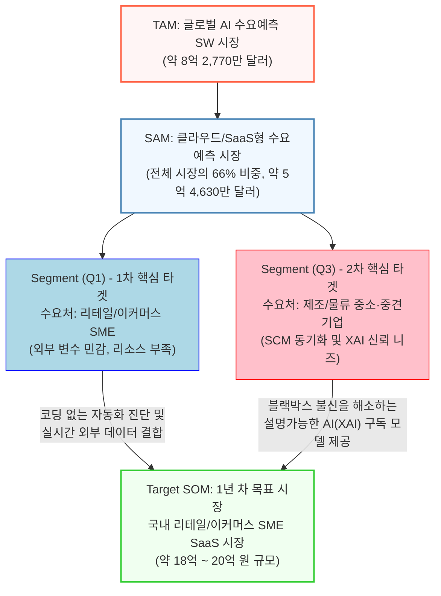

# Value Proposition Sheet — B2B 수요예측 AI SaaS 솔루션 `V2`

**작성자:** 시니어 비즈니스 가치 분석가  
**분석 대상:** 1~2주 차 시장 분석(TAM/SAM/SOM), 기회점수(AOS/DOS), JTBD 심층 인터뷰 결과  
**핵심 타겟:** DOS 산출 기준 [Q1 혁신기회] 최상위 3대 페르소나 (김아름, 권혁수, 정동환)  
**문서 버전:** V2 (비즈니스 분석 통합본)  
**통합 원본:** `01_Biz-Analysis/*` + `01_value-proposition-draft.md` + `02_job-feature-map+MVP-plan.md`

---

## 목차

1. [비즈니스 분석 기반 (Market Foundation)](#1-비즈니스-분석-기반-market-foundation)
   - 1-1. 시장 분석 (5 Forces 요약)
   - 1-2. 경쟁 환경 및 포지셔닝
   - 1-3. 가치 사슬 분석에서 도출된 전략적 시사점
   - 1-4. 핵심 성공 요인 (KSF)
   - 1-5. 통합 문제 정의
   - 1-6. 시장 규모 (TAM/SAM/SOM)
   - 1-7. 페르소나 스펙트럼
   - 1-8. 기회점수 (AOS/DOS) 매트릭스
   - 1-9. JTBD 심층 인터뷰 결과
2. [Problem–Solution Fit (Value Proposition Sheet)](#2-problemsolution-fit-value-proposition-sheet)
   - 2-1. 김아름 — 이커머스/커머스 메인 MD
   - 2-2. 권혁수 — 바이오 콜드체인 물류 관리자
   - 2-3. 정동환 — 3PL 물류센터장
3. [Job–Feature Map (기능 우선순위 및 전략 맵)](#3-jobfeature-map-기능-우선순위-및-전략-맵)
4. [MVP 구현 상세 계획](#4-mvp-구현-상세-계획)
   - 4-1. MVP 스코프 요약
   - 4-2. Phase 로드맵 (Sprint 1→2→3)
   - 4-3. Feature별 상세 명세 (F1·F2·F3)
5. [Post-MVP 확장 로드맵](#5-post-mvp-확장-로드맵)
   - 5-1. F4 — 콜드체인 실시간 노선 재설정기
   - 5-2. F5 — 예산 지출 연동 What-IF 시뮬레이터
   - 5-3. F6 — 모바일 신호등 초간단 발주 UX

---

## 1. 비즈니스 분석 기반 (Market Foundation)

> 💡 본 섹션은 Value Proposition과 MVP 기획의 **근거가 되는 1~2주 차 비즈니스 리서치 결과**를 직접 수록합니다. 모든 전략적 판단은 아래 분석에서 출발합니다.

---

### 1-1. 시장 분석 — Porter's 5 Forces 요약

#### B2B 프레딕티브 AI 솔루션 시장 (핵심 시장)

| 마이클 포터의 5 Forces | 강도 | 시장을 움직이는 핵심 요인 (Key Drivers) |
| :--- | :---: | :--- |
| **신규 진입자의 위협** | **Medium** | 높은 초기 MLOps 구축 비용, 필수 데이터 확보 난이도, 레퍼런스 장벽 |
| **공급자의 교섭력** | **High** | 특화 AI 융합 인재 품귀 현상, 클라우드(CSP) 벤더에 대한 종속성, 외부 데이터 API 프로바이더 독점 |
| **구매자의 교섭력** | **High** | 막대한 ROI 증명 압박, 극심한 커스터마이징 요구, 대형 고객 집중도 |
| **대체재의 위협** | **Medium** | 기 구축된 대규모 ERP/SCM의 내장 모듈(SAP IBP 등), 사내 분석가의 전통적 통계/휴리스틱, 범용 BI 툴(Tableau, PowerBI) |
| **기존 경쟁자 간 경쟁** | **High** | 글로벌 거대 IBP 플랫폼(o9, Blue Yonder, Kinaxis) 기반 선점, 벤더 간 Lock-in 위한 출혈 경쟁 |

> **[시장 매력도 종합 진단]** 본 시장은 전형적인 **'고위험, 고수익(High Risk, High Return)'** 구조. 수요예측 솔루션의 시장 팽창력은 엄청나나, 구매자와 공급자 양측 모두 강력한 협상력을 보유하며 글로벌 벤더들과의 전면전이 불가피합니다. **날카로운 니치(Niche) 타겟팅과 고객 Lock-in 기술 장벽 확보가 필수적**입니다.

#### 3대 연관 시장 5 Forces 핵심 진단

| 연관 시장 | 핵심 발견 | 우리 솔루션에 대한 전략적 시사점 |
| :--- | :--- | :--- |
| **MLOps/AI 플랫폼** | 글로벌 CSP(AWS·GCP·Azure)가 범용 플랫폼을 압도적으로 장악. 국내에서는 마키나락스(제조 특화), 베슬에이아이(GPU 최적화)가 버티컬 접근 | 예측 엔진 뒤의 MLOps 인프라는 **Buy/Partnership** 하고, 핵심 예측 알고리즘만 자체 개발(Build)에 집중 |
| **SCM/ERP 소프트웨어** | SAP이 글로벌 과점. 국내는 더존비즈온(중소 ERP), 엠로(구매/SRM) 독보적. 전환 비용이 천문학적 | 기존 SCM/ERP 시스템에 **Add-on 플러그인** 형태로 기생하는 배포 전략 채택. 독립 UI 대시보드 구축은 위험 |
| **대안 데이터(Alt Data)** | 원천 데이터 보유자(카드사·통신사)의 독점적 교섭력이 압도적. 딥서치가 국내 AI 인덱스 리더 | 초기엔 자체 크롤링 파이프라인 구축으로 원가 통제. 핵심 데이터 파트너 1~2곳만 선별 내재화 |

---

### 1-2. 경쟁 환경 및 포지셔닝

#### 2×2 경쟁사 포지셔닝 맵

- **X축:** 범용 플랫폼(General) ←→ 도메인 특화(Domain Specific)
- **Y축:** 기초 솔루션 ←→ 엔터프라이즈 통합 예측(End-to-End)

> **1사분면 (특화 & 통합 리더):** Blue Yonder, Kinaxis, Streamline  
> **2사분면 (범용 & 통합 리더):** SAP, Oracle, Databricks  
> **3사분면 (범용 & 기초 인프라):** AWS, GCP, Azure  
> **4사분면 (특화 & 챌린저):** 임팩티브AI, YipitData  
>
> 👉 **우리의 전략:** 4사분면에서 출발 → 1사분면으로 확장. 강력한 버티컬 지식(이커머스+물류)을 무기로 진입한 뒤, 기존 2사분면(SAP 등)과 API 통합하여 '플러그 앤 플레이' 가치를 제공.

#### 시장별 잠재 경쟁사 핵심 브리핑

| 시장 | 주요 경쟁사 | 핵심 특징 |
|---|---|---|
| MLOps | AWS SageMaker | 압도적 클라우드 점유율, 완전 관리형 파이프라인, Lock-in |
| | Databricks | 레이크하우스 PaaS, MLflow 오픈소스 표준화 |
| | 마키나락스 | 제조업 특화 버티컬 AI, 온프레미스 엣지 배포 |
| | 베슬에이아이 | 멀티클라우드 GPU 자원 최적화, 직관적 UI/UX |
| SCM/ERP | SAP (IBP) | 글로벌 1위 ERP, 압도적 대기업 Lock-in |
| | Blue Yonder | AI/ML 기반 SCM 엔드투엔드, 수요예측 고도화 |
| | 엠로 | 국내 구매/SRM 독보적 1위, AI 품목 분류 모듈 런칭 |
| | 더존비즈온 | 국내 중소/중견 토종 ERP 시장 점유율 압도, 클라우드 전환 |
| Alt Data | YipitData | 웹 크롤링 + 카드 결제 데이터 → 숏텀 실적 예측 |
| | 딥서치 | 국내 AI 인텔리전스 리더, 기업 데이터 + 뉴스 통합 인덱스 |
| | FactSet | 글로벌 금융/ESG 대안 데이터 올인원 플랫폼 |

---

### 1-3. 가치 사슬 분석에서 도출된 전략적 시사점

3개 핵심 경쟁사(마키나락스, 엠로, 딥서치)의 가치 사슬(Primary + Support Activities)을 분석하여, 우리 솔루션에 직접 적용할 **핵심 교훈**을 추출했습니다.

| 가치 사슬 활동 | 마키나락스 교훈 | 엠로 교훈 | 딥서치 교훈 | **우리의 적용** |
|---|---|---|---|---|
| **입고 물류 (핵심 자원)** | 제조 현장 센서 데이터를 PoC로 수급, 폐쇄망 데이터 자산화 | 대기업 20년 구매 히스토리/단가 DB가 핵심 해자 | 자체 크롤링 + OCR로 외부 API 의존 탈피 | **카페24 주문 API + 기상청 데이터를 자체 수집·정규화하여 데이터 해자 구축** |
| **운영 (프로덕트)** | 경량 앙상블 모델, 온프레미스 엣지 배포 지원 | 거대 프로세스 대체 대신 마이크로서비스 모듈 단위로 쪼개어 API 플러그인 제공 | 도메인 특화 SLM + RAG로 할루시네이션 없는 진단 | **XAI 해설 엔진 + 경량 시계열 모델 조합. 기존 SCM에 API Add-on으로 삽입** |
| **출고 물류 (딜리버리)** | PLC/MES/ERP 시스템에 직접 API 꽂는 배포, 노코드 GUI 캔버스 | iFrame/뷰포트 형태로 기존 사내 포탈에 매끄럽게 삽입 → Standalone 탈피 | 웹 대시보드 SaaS + RESTful API 이중 제공 | **웹 대시보드 + PDF 리포트 + 이커머스 호스팅 내 플러그인 삽입** |
| **마케팅/영업** | ABM(대형 C-Level 집중), PoC 실적으로 Upsell | "정확도 향상"이 아니라 "이달 현금흐름 15억 개선" ROI 문구로 Twist | 기본 검색 무료 미끼 → 프리미엄 데이터/API 유료 업셀 | **"대표님 결재 1-pass" 방어 문구. 파일럿 고객 PoC로 ROI 시각화 후 전사 확장** |
| **인적 자원** | 딥러닝 1명 + MLOps 2명 + 도메인 전문가 1명 스쿼드 | SCM 컨설턴트(도메인 전문가)가 AI 개발자보다 1순위 | 데이터 엔지니어 + NLP 연구원 투트랙 | **시계열 AI 엔지니어 + 이커머스/물류 도메인 전문가 반드시 확보** |
| **기술 자산 보호** | 소스코드 난독화 + 폐쇄망 컨테이너 이미지 | 블랙박스 API 과금/SaaS 구독으로 핵심 알고리즘 방어, 특허 장벽 | 지식 그래프 DB(Neo4j) 아키텍처로 원시 데이터 스키마 난독화 | **예측 엔진은 SaaS API 과금 모델로 코어 IP 보호. 특허 출원 선행** |
| **조달/파트너십** | 하드웨어 벤더와 Pre-install 제휴 (H/W-SaaS 융합) | 대형 SI 업체(삼성SDS, LG CNS) AI 부문 파트너로 진입 | 증권사/신평사와 바터(물물교환) 조달로 프리미엄 데이터 원가 0원화 | **카페24·스마트스토어 등 이커머스 호스팅사와 연동 제휴. 기상청 무료 API 극대화** |

---

### 1-4. 핵심 성공 요인 (KSF) — Top 5 통합

3개 연관 시장(MLOps, SCM/ERP, Alt Data) KSF를 교차 분석하여, 우리 솔루션에 가장 직결되는 **통합 KSF 5가지**를 도출합니다.

| # | KSF | 출처 시장 | 핵심 근거 |
|---|---|---|---|
| 1 | **설명 가능한 AI(XAI) + 재무적 ROI 즉시 환산 대시보드** | 핵심 시장 + SCM | 5 Forces '구매자의 높은 교섭력' 극복. CFO/CPO는 정확도(MAPE)가 아니라 "절감된 현금 금액(₩)"만 봄. 가치 사슬 M&S 항목의 ROI Twist 원칙. |
| 2 | **레거시 SCM/ERP에 기생하는 Add-on 플러그인 배포** | SCM/ERP | 5 Forces '대체재 위협' 및 '진입 장벽'. SAP/엠로 화면 밖의 새 창을 띄우면 실무자 즉시 이탈. 가치 사슬 'Outbound Logistics'의 Standalone 탈피 원칙. |
| 3 | **외부 대안 데이터 자체 수집 파이프라인 (원천 API 의존 탈피)** | Alt Data | 5 Forces '공급자의 극단적 교섭력' 방어. 유료 API 전적 의존 시 원가 통제 불능. 딥서치의 자체 크롤링 전략 참조. |
| 4 | **특정 버티컬(이커머스/물류) 도메인 특화 알고리즘 100% 자체 IP화** | MLOps | 범용 AI로는 글로벌 CSP를 이길 수 없음. 마키나락스의 제조 특화 전략 참조. 이커머스 계절성·프로모션 특수 로직을 코어 IP로 축적. |
| 5 | **초기 인프라 비용 제로(0)화 — 외부 그랜트 및 파트너 자원 활용** | MLOps + Alt Data | 자체 GPU 매입은 Burn Rate 폭증. AWS 스타트업 크레딧·정부 기술 과제·네이버클라우드 지원 프로그램 등을 영악하게 스크랩. |

---

### 1-5. 통합 문제 정의 (Problem Statement)

3대 연관 시장의 약점을 융합 분석한 결과 도출된 핵심 문제:

> **[자체 IT 인프라나 고급 데이터 개발 조직이 없어 수요 관리에 취약하지만, 폭발하는 외부 환경 변동성에 매일 맨몸으로 맞서야 하는 B2B 실무 담당자(이커머스 MD, 3PL 센터장, 콜드체인 유통 담당자 등)]**가
>
> **[날씨, 유통기한, 트렌드, 돌발 프로모션 등 예측하기 힘든 외부 변수를 즉각 반영하여 당일 발주량 및 창고 알바 인원 스케줄 등을 신속히 결정하고, 보수적인 결재권자의 승인을 방어적으로 받아내야 하는 상황]**에서 겪는
>
> **[기존 수기 엑셀의 통계적 결측 한계와 AI 블랙박스(불투명성)로 인해 빈번히 대규모 결품, 악성 재고 폐기가 터져 영업이익이 훼손되는 심각한 재산 손실 문제와, 무겁고 비싼 전사 ERP 시스템 밖에서 이 사태를 가볍고 빠르게(Add-on 및 No-code) 틀어막아 줄 통합 보호 솔루션의 치명적인 부재 고통]**을 해결합니다.

#### 솔루션의 3대 핵심 타겟 가치

1. **내/외부 변수 자동 결합 로직 엔진:** 고객의 기존 엑셀·쇼핑몰 API에서 추출된 사내 데이터와 날씨·보건·검색어 등 대안 데이터를 엮어 실시간 맞춤 발주량 산출
2. **현장 맞춤형 No-Code 및 기생형(Add-on) 배포:** 웹 클릭 한 번으로 모델 동작. 이커머스 호스팅·사내 메신저·구글 시트에 가볍게 꽂히는 플러그인 전략
3. **XAI(설명가능 AI) 보고서 + 액션 시그널:** "내일 비 오니 권장량 15% 상향" 즉각 행동 지시 + 버튼 한 번으로 [임원 결재용 재무 방어 PDF 기안서] 자동 생성

---

### 1-6. 시장 규모 — TAM / SAM / SOM

| 구분 | 시장 정의 | 규모 | 근거 |
| :--- | :--- | :--- | :--- |
| **TAM** | 글로벌 AI 수요예측 소프트웨어 시장 | **약 8억 2,770만 달러** (약 1조 1,100억 원) | FMI 2025년 글로벌 통계 |
| **SAM** | 클라우드/SaaS형 수요예측 AI 시장 (구축형 제외) | **약 5억 4,630만 달러** (약 7,300억 원) | TAM × 클라우드 비중 66% |
| **SOM** | 글로벌+국내 SME 대상 SaaS 시장 | **[글로벌] 약 2억 3,490만 달러** **[국내] 약 400만 달러 (54억 원)** | SAM × SME 비중 43%, 한국 AI SW 점유율 1.7% |
| **Target SOM (1년차)** | 국내 리테일/이커머스 SME SaaS | **약 140만 달러 (18~20억 원)** | SOM 중 이커머스/리테일 비중 35% |

> **1년 차 현실적 점유 목표:** Target SOM ~20억 원 중 5~10% 수준 (약 1억~2억 원, 초기 레퍼런스 고객 10~20곳)

---

### 1-7. 페르소나 스펙트럼 — 12인 요약

#### 전체 스펙트럼 요약표

| 구분 | 페르소나 | 직무 | 핵심 Pain Point | 주요 니즈 | 대체 솔루션 | 시장 근거 |
| :---: | :--- | :--- | :--- | :--- | :--- | :--- |
| 🟢 **핵심** | **김아름** (우선) | 코스메틱 MD | 외부 변수(날씨/트렌드) 품절 | 외부 변수 종합 단기 발주 권장량 | 엑셀 수기 계산 | Q1(이커머스 SME) |
| 🟢 핵심 | 박현우 | SCM 팀장 | AI 블랙박스 설득 불가 | XAI 인과관계 모델 | SAP 모듈 | Q3(제조/물류 SME) |
| 🟢 핵심 | 이진수 | F&B 재고 파트장 | 상권별 날씨 변동 폐기 | 상권 단위 물동량 자동 산출 | 동일 요일 평균 | Q1/Q3 교집합 |
| 🟢 핵심 | 최유진 | 퍼포먼스 마케터 | 유입/재고 소진 인과 한계 | 예산별 재고 소진 시뮬레이션 | GA + 재고 교차 | Q1(유통) |
| 🟢 핵심 | **정동환** (우선) | 3PL 센터장 | 화주 프로모션 누락 인건비 낭비 | 외부 변수+화주 데이터 인력 최적화 | 수동 메신저 취합 | Q3(물류) |
| 🟡 **확장** | **권혁수** (우선) | 콜드체인 담당 | 유통기한 실패 = 전량 폐기 | 하드코어 조건 반영 배분 설정 | 공공 데이터 수동 | 프리미엄 Up-Sell |
| 🟡 확장 | 송미란 | 식자재 영업 | B2B 거시 변수 파악 한계 | B2B 특화 예측 | 구두 약속(인맥) | B2B 지표 연결성 |
| 🟡 확장 | 이유리 | 공간 기획자 | 팝업 주말 트래픽 예측 | 시간/공간 다이나믹 프라이싱 | 과거 수기 기록 | 서비스 도메인 확장 |
| 🟠 **극단** | **김철수** (우선) | 부품 제조 공장장 | 1만개 SKU 결측치 AI 붕괴 | 간헐적 수요 군집화 | 상위 100개만 관리 | 결측치 엣지 테스트 |
| 🟠 극단 | 강태용 | 새벽배송 총괄 | 반나절 기상 오차 식품 부패 | 시간 단위 동적 실시간 발주 | 수동 경고 시스템 | 극초단기 부하 테스트 |
| 🔴 **비활성** | **알렉스 정** (우선) | 대기업 데이터 리더 | 외부 SaaS 신뢰 불가(NIH) | 내부망 가벼운 모듈 수혈 | Databricks 인하우스 | Headless API 근거 |
| 🔴 비활성 | 박영자 | 영세 도매 | 디지털 거부, 감 의존 | 변화 거부 | 수기 장부 | TAM 배제군 |

#### 핵심 4대 페르소나 시장 존재 확률

| 타겟 | 존재 확률 | 핵심 실증 근거 | 전략적 가치 |
| :--- | :--- | :--- | :--- |
| **김아름** (이커머스 MD) | **매우 높음** (수십만 SME) | 내부 분석 조직 없는 기업 71%, 수작업 엑셀 잔존 90%+ | 즉각적 결품 Pain → 월 결제 SaaS 전환 1순위 |
| **권혁수** (콜드체인) | **높음** (고부가가치) | 유통기한/온도 이탈 1회 = 수억 원 재무 타격 | 초고가 프리미엄(보험성) 요금제 |
| **김철수** (소량다품종) | **매우 높음** (뿌리산업) | 비정기적 주문 결측치 지배적 구조, 현장 직관 의존 | 군집화 로직으로 블루오션 창출 |
| **알렉스 정** (대기업 데이터) | **100% 확실** | NIH 신드롬, 수백억대 레거시, 클라우드 정책 방어 | Headless API 제공 로드맵 근거 |

---

### 1-8. 기회점수 — AOS / DOS 매트릭스

> **AOS:** Importance × (1 - Satisfaction / 5) — 고객 1인의 체감 강도  
> **DOS:** (Importance - Satisfaction) × Market Relevance(TAM%) — 시장 파급력 가중 기회점수

#### 페르소나 12인 기회점수 통합 산출 테이블

| 페르소나 (유형) | 핵심 Pain & Goal | Imp | Sat | AOS | TAM% | **DOS** | 사분면 |
| :--- | :--- | :---: | :---: | :---: | :---: | :---: | :---: |
| **김아름** (Core) | 외부 변수 미반영 품절 방어 → 기상 연동 일일 발주 권장량 | 5 | 2 | **3.0** | 0.9 | **2.7** | **Q1 혁신** |
| 이진수 (Core) | 초국지적 기상 변동 식자재 폐기 → 상권별 트래픽/재고 배분 | 5 | 2 | **3.0** | 0.8 | **2.4** | Q1 혁신 |
| **정동환** (Core) | 화주 프로모션 누락 인건비 덤핑 → 단기 출고 물동량 인력 최적화 | 5 | 1 | **4.0** | 0.5 | **2.0** | **Q1 혁신** |
| 강태용 (Ext) | 반나절 기상 오차 신선 배송 붕괴 → 극초단기 실시간 제어 | 5 | 2 | **3.0** | 0.6 | **1.8** | Q1 혁신 |
| **권혁수** (Adj) | 온도/유통기한 이탈 수억 원 전량 폐기 → 리스크 0% 통제 | 5 | 1 | **4.0** | 0.4 | **1.6** | **Q1 프리미엄** |
| 최유진 (Core) | 마케팅-재고 소진 시뮬레이션 → What-If 예측 | 4 | 2 | 2.4 | 0.7 | 1.4 | Q2 개선 |
| 김철수 (Ext) | 희소 결측치 + PC 조작 장벽 → 군집화 + 모바일 신호등 UX | 4 | 2 | 2.4 | 0.7 | 1.4 | Q2 개선 |
| 박현우 (Core) | AI 블랙박스 불신 → XAI 기안용 리포트 | 4 | 2 | 2.4 | 0.6 | 1.2 | Q2 개선 |
| 이유리 (Adj) | 오프라인 팝업 트래픽 예측 → 공간/시간 시뮬레이션 | 4 | 2 | 2.4 | 0.3 | 0.6 | Q2 엣지 |
| 알렉스 정 (Non) | 폐쇄망 SaaS 이질감 → Headless API 모듈 수혈 | 5 | 4 | 1.0 | 0.8 | 0.8 | Q3 캐시카우 |
| 송미란 (Adj) | B2B 거시 변수 → 재택/근로 지수 융합 예측 | 3 | 3 | 1.2 | 0.5 | 0.0 | Q4 과잉투자 |
| 박영자 (Non) | 디지털 거부 | 1 | 5 | 0.0 | 0.2 | -0.8 | Q4 배제 |

#### AOS-DOS 4사분면 전략 요약

| 사분면 | 포지션 | 대상 | 행동 |
|---|---|---|---|
| **🔥 Q1** | MVP 핵심 타겟 | 김아름·이진수·정동환·강태용·권혁수 | 외부 API 통합 파이프라인에 리소스 80% 집중 |
| 💡 Q2 | Niche 개척 | 최유진·김철수·박현우·이유리 | 코어 런칭 후 업셀링 단계에서 추가 기능 |
| ⚙️ Q3 | Cash Cow 제휴 | 알렉스 정 | 화면 UI 배제, Headless API 납품 |
| 🚫 Q4 | 과잉투자 배제 | 송미란·박영자 | MVP 개선 사항에 절대 반영 금지 |

---

### 1-9. JTBD 심층 인터뷰 결과 (Top 3 페르소나)

DOS Q1 상위 3인(김아름, 권혁수, 정동환)에 대한 JTBD 인터뷰 핵심 결과입니다.

#### Case 1 — 김아름 (이커머스 MD)

| 구분 | 내용 |
| --- | --- |
| **Situation** | 주말 폭우 + 유튜브 숏폼 대박으로 예상치 못한 발주가 3시간 만에 동나버린 비상 상황 |
| **Job Statement** | 외부 트렌드를 실시간 반영한 권장 발주량을 도출해, **임원진 결재를 한 번에 통과시키고자 함** |
| **Desired Outcome** | 월 결품률 15% → 0% 방어. 발주 엑셀 수기 취합 야근 4시간 → 10분 이내 |
| **Push** | 기상 변수를 엑셀 함수로 짜려다 박살 나서 밤샌 스트레스 |
| **Pull** | 버튼 한 번으로 '상사 기안용 트렌드 근거 PDF'가 튀어나오는 매력 |
| **Habit** | "그래도 대표님은 엑셀 표 아니면 안 읽으시는데?" 구세대 보고 관행 |
| **Anxiety** | "새 시스템이 뽑은 숫자가 틀리면, 결국 내 책임(독박) 아닌가?" 실무적 두려움 |
| **Switch Trigger** | 대규모 결품 사태 후 시말서를 썼던 날 |
| **핵심 인용** | *"날씨 엑셀 합치다가 컴다운되면 진짜 다 때려치고 싶어요."* — 지난달 누적 기회 손실액 **약 2,500만 원** |
| **MVP 시사점** | 화면 통계보다 **[대표님 결재용 일일 리포트 PDF 도출]** 버튼 최우선 배치 |

#### Case 2 — 권혁수 (바이오 콜드체인)

| 구분 | 내용 |
| --- | --- |
| **Situation** | 수도권 폭염 경보로 배송 트럭 대기시간이 늘어 유통기한 임계점이 턱 끝까지 다가온 순간 |
| **Job Statement** | 수억 원의 폐기를 막기 위해, 어떤 약국에 먼저 백신을 떨어야 할지를 **리스크 0%로 통제 모니터링** |
| **Desired Outcome** | 유통기한/온도 관련 폐기 비용 0% 방어. 수작업 확인 강박적 두려움 80% 하락 |
| **Push** | 작년 여름 온도 로거 체크 실수로 **백신 3억 원어치 현장 폐기** — 징계·해고 위기 |
| **Pull** | 유통기한+온도 교차 연산으로 '이곳으로 당장 먼저 배송해!' AI 강제 지시 안정감 |
| **Habit** | "이 바닥은 서류에 잉크를 찍어야 법적으로 면피된다" 보수적 장벽 |
| **Anxiety** | "AI가 계산 오류 내서 독감 백신 폐기되면? 나보고 책임지라는 거 아냐?" |
| **Switch Trigger** | 유통기한 딱 1시간 놓쳐서 억 단위 백신 전량 폐기 후 사내 감사 |
| **핵심 인용** | *"냉동 탑차 온도 1도 떨어지는 거 보는 제 피가 거꾸로 솟는 것 같아요."* — 휴먼 에러 연 2회 |
| **영업 전략** | 박리다매 불가. **'사고 예방 보험' 성격 B2B 최고가 요금제**로 어필 |

#### Case 3 — 정동환 (3PL 물류센터장)

| 구분 | 내용 |
| --- | --- |
| **Situation** | 화주들이 주말에 인플루언서 공구를 때려서 월요일 택배 물량 10배 폭증 |
| **Job Statement** | 화주 판매/프로모션 시그널을 캐치해 **내일 필요한 일용직 알바 인원수를 오차 없이 최적화** |
| **Desired Outcome** | 오버 스케줄링 낭비율 0%. 출고 지연 화주 컴플레인 월 0건 |
| **Push** | 화주 MD들이 전화 안 받고 프로모션 정보를 숨길 때마다 인건비 적자 폭발 |
| **Pull** | 모든 화주 데이터를 긁어와서 "내일 50명만 부르세요" 명확히 찍어주는 확신 |
| **Habit** | 인력사무소 소장님과 매일 밤 전화 "대충 30명 맞춰주소" 수동 관행 |
| **Anxiety** | "화주사들이 자기 판매 데이터를 우리 앱에 연동하려 할까?" 데이터 제공 저항 |
| **Switch Trigger** | 알바 10명 불렀는데 물건 2천 개 터져서 새벽 3시까지 본인이 직접 까대기 |
| **핵심 인용** | *"화주 이놈들은 물건 팔 땐 말 안 해주고, 배송 지연되면 저한테 위약금 내놓으래요."* — 일일 허공 증발 인건비 **80만 원** |
| **MVP 기획** | AI 엔진보다 먼저 **카페24 등 쇼핑몰 API 셀프 연동 기능**이 핵심 |

#### JTBD 인터뷰 기반 Outcome 우선순위 통합 리스트

| Outcome | Imp | Sat | AOS | DOS | 검증 증거 | MVP 기능 |
| --- | :---: | :---: | :---: | :---: | --- | --- |
| **품절 손실 방어율 (15%→0%)** | 5 | 2 | 3.0 | **2.7** | "기상청 앱이랑 구글 띄워두고 수동 대조하다 퇴사 마렵습니다" | 외부 기상/트렌드 자동 결합 지수 |
| **결재 승인 소모시간 (4h→10m)** | 4 | 2 | 2.4 | 1.4 | "제 직관은 대표님이 안 믿어요. 백 데이터 근거가 필요합니다" | XAI + PDF 보고서 자동 생성 |
| **온도 이탈 페널티 방어 (수억→0)** | 5 | 1 | 4.0 | **1.6** | "차량 온도 1도 떨어지는 거 보는 피가 거꾸로 솟아요" | 유통기한/온도 하드코어 제약 모델 (프리미엄) |
| **내일 알바 오차 (20%→1%)** | 5 | 1 | 4.0 | **2.0** | "화주들이 프로모션 건 거 말을 안 해줘서 내 돈 내고 알바 놀게 합니다" | 카페24 API 원클릭 연동 + 출고 대시보드 |

---

## 2. Problem–Solution Fit (Value Proposition Sheet)

> 💡 *고수준 분석 컨텍스트:* 기존의 뜬구름 잡는 브레인스토밍이 아닌, 각 고객이 처한 **"생존과 직결된 리스크(Pain)"**를 **"어떻게 방어할 것인지(Outcome)"**에 초점을 맞추어 문서 밀도를 극대화했습니다.

---

### 2-1. 👩‍💼 김아름 (이커머스/커머스 메인 MD)
*파급력 최고점: 타겟 볼륨(TAM 90%)과 고객 체감 강도(AOS 3.0)가 결합된 `DOS 2.7`의 절대적 1순위 시장*

| 항목 | 내용 |
| --- | --- |
| **핵심 문제 서술 (Pain, Needs)** | 외부 환경 변수(폭우, 한파, 인플루언서발 트렌드)를 수작업 엑셀에 즉시 반영하는 것이 불가능함. 수요 예측 실패 시 대규모 결품(품절)으로 이어져 엄청난 기회손실과 사내 징계 유발. |
| **목표 서술 (Goal, Job)** | 갑작스러운 수요 변동(장마, 유행)이 발생했을 때, 임원진이 수긍할 수 있는 **객관적 지표(외부 데이터)가 반영된 발주서를 즉각 산출해 '반려 없이' 결재를 통과받고 책임을 면피**하고자 함. |
| **고객이 원하는 Outcome** | ① 결품/과발주로 인한 쇼핑몰 기회손실액 월 2,500만 원 → **0원 방어** ② 기상청 데이터 캡처 및 엑셀 취합을 위한 일일 야근 시간 4시간 → **10분 단축** ③ 발주 품의서 제출 시 경영진의 재검토(반려) 횟수 월 5회 → **0회 (1-pass)** |
| **우리 솔루션의 핵심 제안 (Value Proposition)** | **"단 1번의 스크롤로 기상/트렌드/매출 변수가 융합된 [대표님 결재 프리패스용 일일 발주 방어 PDF 리포트] 즉각 자동 완성"** |
| **기존 대안 (Competitor / Substitute)** | 3년 치 과거 판매량 엑셀 + 네이버 날씨 앱 수동 듀얼 모니터 대조 (원시적 대안).  마키나락스 등 대형 MLOps 인프라 (초기 구축 억 단위 비용 및 긴 리드타임으로 도입 기안 즉시 보류). |
| **우리가 제공하는 차별적 가치** | 기술적 우위(단순 예측 정확도)를 뽐내는 것이 아니라, 결재권자인 임원을 설득하기 위해 딥러닝 로직을 문장으로 해설해 주는 **'설명 가능한 AI(XAI) 해설 엔진'을 경영진 문서 양식에 맞게 뱉어내는 실무 정치 친화형 UI** |
| **Proof (근거 / 검증 데이터)** | JTBD 검증(Case 1): "대표님이 못 믿는 AI 숫자는 쓸모없다"는 철저한 B2B 결재 한계 확인. DOS 2.7 점수로, 이커머스 시장 침투 시 확장성이 다른 페르소나 대비 2배 이상 높음. |

> 🔗 **연관 MVP 기능:** [F1. 결재 방어용 XAI 원클릭 리포트 추출](#f1--결재-방어용-날씨트렌드-융합-xai-원클릭-리포트-추출)

---

### 2-2. 👨‍🔬 권혁수 (바이오 콜드체인 물류 관리자)
*생존 마진 최고점: 극단적 리스크 환경 속 가장 가혹한 고통(`AOS 4.0`), 초고마진 프리미엄 Niche 시장*

| 항목 | 내용 |
| --- | --- |
| **핵심 문제 서술 (Pain, Needs)** | 여름철 배차 지연이나 기사의 실수 등 아주 사소한 예외 상황 하나로, 수억/수십억 원 대의 백신 및 바이오 제품이 '유통기한(Shelf-life)이나 온도 이탈'을 맞아 영구 폐기되는 극악무도한 감시 체계에 시달림. |
| **목표 서술 (Goal, Job)** | 예기치 못한 폭염, 교통 혼잡 속에서 유통기한 임계점이 다가올 때, **단 1개의 제품도 손실 없이 가장 먼저 배송/하차해야 할 지역으로 통제 권한을 획득하고자 함.** |
| **고객이 원하는 Outcome** | ① 휴먼 감시 에러로 인한 온도 이탈 통제 실패 연 2회 → **0건 완전 제어** ② 대형 의약품 폐기로 인한 손실금(사고당 3억~10억) → **0원 방어 보험** |
| **우리 솔루션의 핵심 제안 (Value Proposition)** | **"1억 원어치의 제품을 변기통에 버리기 전, 당신의 직장과 재산을 지켜줄 법적 추적 완비형 [보험 연계 하드코어 콜드체인 제약 통제 API]"** |
| **기존 대안 (Competitor / Substitute)** | 질병관리청 역학 앱 수동 크롤링 및 트럭 기동용 아날로그 USB 온도 로거(하차 시 엑셀 다운로드 후 사후 대조). 사후 약방문 구조. |
| **우리가 제공하는 차별적 가치** | 원가 절감을 위한 범용 SaaS가 아님. 치명적 사고 발생 직전에 트럭의 노선을 AI가 '강제 재설정' 해주는 **'경고 통제권'을 제공하여 실무자의 숨 막히는 불안감(Anxiety)을 영구 제거하는 심리적 록인(Lock-in)**. |
| **Proof (근거 / 검증 데이터)** | JTBD 검증(Case 2): "기사가 화장실 간 사이 백신 3억 폐기"라는 생존 위협 경험. 시장 볼륨은 평균이나(DOS 1.6), 페인 지수가 전 세그먼트 중 최고(AOS 4.0)이므로 특수 프리미엄 요금제로 방어 가능. |

> 🔗 **연관 기능:** [F4. 콜드체인 실시간 노선 재설정기 *(Post-MVP)*](#f4--콜드체인-실시간-노선-재설정기)

---

### 2-3. 👷‍♂️ 정동환 (3PL 물류센터장)
*B2B 생태계 허브: `DOS 2.0`, 물류비(인건비)라는 확실하고 즉각적인 현금 환금성을 지닌 블루오션*

| 항목 | 내용 |
| --- | --- |
| **핵심 문제 서술 (Pain, Needs)** | 화주(소호 쇼핑몰 사장들)가 트래픽 유발형 프로모션(유튜브 공구 등) 계획을 공유해 주지 않고 은폐하여, 월요일 아침 센터 내 일용직(알바) 스케줄링 조절에 실패해 막대한 인건비 손실(적자)이 발생함. |
| **목표 서술 (Goal, Job)** | 소통이 단절된 얌체 화주사들의 프로모션 데이터를 어떤 방식으로든 당겨와서, **내일 우리 창고로 출근시켜야 할 '낭비 없는 정확한 일용직 알바 숫자(50명)'를 5시 전에 사전 확정 짓고 싶음.** |
| **고객이 원하는 Outcome** | ① 초과 알바로 허공에 뿌리는 일일 잉여 임금액 일 80만 원 → **0원** ② 인원 펑크로 발생하는 당일 출고 지연 화주사 위약금 및 클레임 월 0회 |
| **우리 솔루션의 핵심 제안 (Value Proposition)** | **"가장 귀찮았던 화주사 소통 끝. 카페24 완전 코어 연동으로 내일 출근할 최적의 알바 인원수를 스스로 찍어주는 [스마트 센터장 인건비 옵티마이저]"** |
| **기존 대안 (Competitor / Substitute)** | 50여 개 화주 MD들에게 오후 4시마다 카카오톡 찔러보기(답장률 낮음). 밤 10시 인력소 소장님과 구두 협상으로 '가라 맞추기'. |
| **우리가 제공하는 차별적 가치** | 화주사(고객의 고객)들이 자발적으로 플랫폼에 호스팅 API를 물리게 만드는 편의성(1-click 연동 지원) 탑재. 물류센터 내부망 혁신을 넘어선 **'생태계 통합 플랫폼(Hub)'**으로의 진화. |
| **Proof (근거 / 검증 데이터)** | JTBD 검증(Case 3): 직접적인 현금성 낭비(일용직 인건비 80만 원/일) 데이터 확인. 이커머스 쇼핑몰의 뒤를 받치고 있는 3PL 생태계 전체로 솔루션 파급 확장(Virality) 가능성 강력함. |

> 🔗 **연관 MVP 기능:** [F2. 쇼핑몰 플랫폼 API 연동 모듈](#f2--쇼핑몰-플랫폼카페24-등-api-원클릭-연동-모듈) · [F3. 적정 고용 인원 역산 기능](#f3--일일-택배출고-처리능력capacity-기반-적정-고용-인원-역산-기능)

---

## 3. Job–Feature Map (기능 우선순위 및 전략 맵)

Value Proposition을 달성하기 위해 당장 투입해야 할 백로그 및 제품 개발 우선순위(MVP)를 지정합니다. 단순 기술 구현보다는 **"고객의 Job을 달성하여 돈을 받을 수 있는가?"**에 집중하여 분류했습니다.

| 기능명 | 핵심 Job 연관성 | 중요도 (1~5) | 개발 난이도 (1~5) | 우선순위 (High/Mid/Low) | MVP 포함 |
| --- | --- | :---: | :---: | :---: | :---: |
| **F1. [결재 방어용] 날씨/트렌드 융합 XAI 원클릭 리포트 추출** | 김아름(MD)의 기안서 통과 및 사내 정치(방어권) 니즈를 직접 해결. (예측 딥러닝 백엔드 포함) | **5** | 4 | **High** | **✔** |
| **F2. [비협조 우회] 쇼핑몰 플랫폼(카페24 등) API 원클릭 연동 모듈** | 정동환(3PL) 화주사들의 데이터 은폐 체계를 우회. 솔루션 초기 점유율 확보의 치트키 성격. | **5** | 3 | **High** | **✔** |
| **F3. [인건비 방위] 일일 택배/출고 처리능력(Capacity) 기반 적정 고용 인원 역산 기능** | 정동환(3PL) 센터의 알바비 적자를 막아주는 대시보드. 즉각적인 비용 절감(현금성 O). | **4** | 3 | **High** | **✔** |
| **F4. [생존 방위] 백신/냉장 유통기한 임계치(Hard-Constraint) 기반 실시간 노선 재설정기** | 권혁수(콜드체인) 수억 원의 폐기 방어. (차량 실시간 GPS/온도 융합 필요) | **5** | **5** | **Mid** | **✖** (고비용) |
| **F5. [부서 우회] 예산 지출 연동 재고/광고 고갈(What-IF) 시뮬레이터** | 최유진(마케터) 스케일업 파이프라인. 기존 MVP 엔진 위에 광고 데이터(GA4)만 얹는 응용. | 3 | 4 | Mid | ✖ |
| **F6. [직관 통제] 모바일 신호등(적/녹/황) 초간단 발주 UX** | 김철수(공장) 노안 작업자 흡수. PC UI 구축 후 웹앱 패키징. | 3 | 2 | Low | ✖ |

---

## 4. MVP 구현 상세 계획

> MVP 대상 기능(F1·F2·F3)에 대해, **먼저 전체 그림(스코프·Phase 로드맵)을 제시**한 뒤 **Feature별로 드릴다운**하는 Top-Down 구조입니다.

### 4-1. MVP 스코프 요약

| 구분 | 내용 |
| --- | --- |
| **MVP 대상 기능** | F1 (XAI 리포트), F2 (카페24 API 연동), F3 (적정 인원 역산) |
| **1차 타겟 페르소나** | 김아름(이커머스 MD), 정동환(3PL 센터장) |
| **핵심 성공 지표(KPI)** | ① 발주 리포트 1-pass 결재율 ≥ 80% ② 일용직 인건비 절감률 ≥ 30% ③ 카페24 연동 성공률 ≥ 95% |
| **예상 MVP 기간** | 12주 (3개 스프린트 × 4주) |

### 4-2. Phase 로드맵 (Sprint 1→2→3)

#### 🔹 Phase 1 — 데이터 파이프라인 구축 (Sprint 1 · 4주)

| 항목 | 상세 |
| --- | --- |
| **목표** | 외부 데이터(기상청 API, 카페24 주문 API, 네이버 트렌드)를 수집·정규화하는 공통 인프라 확보 |
| **핵심 산출물** | ① 기상청 단기·중기 예보 수집 파이프라인 ② 카페24 쇼핑몰 주문/재고 API 연동 모듈 (F2 핵심) ③ 데이터 레이크 스키마 설계 및 ETL 자동화 |
| **기술 스택** | Python (FastAPI), Apache Airflow, PostgreSQL, AWS S3 |
| **리스크/대응** | 카페24 API Rate Limit → 배치 큐잉 및 캐시 레이어 적용 |
| **관련 Feature** | **F2** (핵심), F1·F3 (데이터 공급) |

#### 🔹 Phase 2 — 예측 엔진 + XAI 해설 모듈 (Sprint 2 · 4주)

| 항목 | 상세 |
| --- | --- |
| **목표** | 수요 예측 딥러닝 모델 학습 및 **설명 가능한 AI(XAI) 해설 텍스트 자동 생성** |
| **핵심 산출물** | ① 시계열 예측 모델 (TFT / N-BEATS 등 경량 앙상블) ② SHAP 기반 변수 기여도 해석 → 경영진용 자연어 해설 변환 엔진 ③ 적정 고용 인원 역산 로직 (출고 Capacity ÷ 인당 처리량) |
| **기술 스택** | PyTorch, SHAP, LLM 서머라이저 (경영진 문서 톤 조정) |
| **리스크/대응** | 초기 데이터 부족 → 합성 데이터(Synthetic Data) + 전이학습 병행 |
| **관련 Feature** | **F1** (핵심), **F3** (핵심) |

#### 🔹 Phase 3 — 프론트엔드 + PDF 리포트 + 파일럿 (Sprint 3 · 4주)

| 항목 | 상세 |
| --- | --- |
| **목표** | 실무자가 즉시 사용 가능한 대시보드 UI 및 **결재용 PDF 리포트 자동 생성** 완성, 파일럿 고객 검증 |
| **핵심 산출물** | ① 웹 대시보드 (일일 발주 현황 + 예측 변동 알림) ② [대표님 결재 프리패스] PDF 리포트 자동 완성 (F1 최종 산출물) ③ [스마트 센터장] 내일 출근 알바 인원수 대시보드 (F3 최종 산출물) ④ 파일럿 고객 2사 대상 4주 PoC 운영 |
| **기술 스택** | React, Recharts, Puppeteer (PDF 렌더링), Vercel |
| **리스크/대응** | 파일럿 고객 확보 지연 → JTBD 인터뷰 대상자 3인에 우선 제안 |
| **관련 Feature** | **F1** (최종), **F3** (최종) |

---

### 4-3. Feature별 상세 명세

> Phase 로드맵에서 **전체 실행 흐름**을 확인한 뒤, 아래에서 각 Feature 단위로 **기술 요소·KPI·리스크를 드릴다운**합니다.

#### F1 — 결재 방어용 날씨/트렌드 융합 XAI 원클릭 리포트 추출

| 항목 | 상세 |
| --- | --- |
| **MVP 포함** | ✔ Yes |
| **우선순위 / 난이도** | High / 4 |
| **대상 페르소나** | 👩‍💼 김아름 (이커머스 MD) |
| **해결하는 핵심 Job** | 외부 변수(날씨·트렌드)가 반영된 발주서를 즉각 산출해 경영진 결재를 1-pass 통과 |
| **주요 산출물** | 경영진 결재용 PDF 리포트 (기상/트렌드/매출 변수 융합, XAI 해설 포함) |
| **핵심 기술 요소** | · 딥러닝 수요예측 백엔드 (시계열 모델) · 기상청 API / 네이버 트렌드 크롤링 파이프라인 · XAI(Explainable AI) 해설 엔진 — 예측 로직을 한국어 문장으로 변환 · PDF 리포트 자동 생성 모듈 (경영진 문서 양식 템플릿) |
| **성공 지표 (KPI)** | · 리포트 생성 소요 시간 ≤ 10분 · 경영진 반려 횟수 월 0회 (1-pass) · 기회손실액 방어율 ≥ 90% |
| **리스크 / 의존성** | · 기상청 API 안정성 및 호출 제한 · XAI 해설 품질이 경영진 기대 수준에 미달할 가능성 → 초기 고객 피드백 루프 필수 |
| **Phase 배치** | Phase 1(데이터) → Phase 2(모델·XAI) → Phase 3(PDF·UI) |

---

#### F2 — 쇼핑몰 플랫폼(카페24 등) API 원클릭 연동 모듈

| 항목 | 상세 |
| --- | --- |
| **MVP 포함** | ✔ Yes |
| **우선순위 / 난이도** | High / 3 |
| **대상 페르소나** | 👷‍♂️ 정동환 (3PL 물류센터장) |
| **해결하는 핵심 Job** | 비협조적 화주사의 실시간 판매/프로모션 데이터를 자동 수집하여 수요 예측 입력값 확보 |
| **주요 산출물** | 카페24, 스마트스토어 등 주요 이커머스 플랫폼 연동 커넥터 |
| **핵심 기술 요소** | · 카페24 / 스마트스토어 / 쿠팡 마켓플레이스 Open API 커넥터 · OAuth 2.0 기반 1-click 인증 플로우 · 실시간 주문/프로모션 데이터 수집 및 정규화 파이프라인 · 화주사 자발적 온보딩을 유도하는 UX (편의성 극대화) |
| **성공 지표 (KPI)** | · 화주사 API 연동 완료율 ≥ 70% (50개 화주 기준 35개 이상) · 데이터 수집 지연시간 ≤ 5분 · 카카오톡 수동 소통 제거율 ≥ 80% |
| **리스크 / 의존성** | · 플랫폼별 API 스펙 변경 리스크 → 버전 관리 체계 필수 · 화주사 참여 동기 부여 전략 필요 (인센티브 설계) |
| **Phase 배치** | **Phase 1**(핵심, 커넥터 구축) |

---

#### F3 — 일일 택배/출고 처리능력(Capacity) 기반 적정 고용 인원 역산 기능

| 항목 | 상세 |
| --- | --- |
| **MVP 포함** | ✔ Yes |
| **우선순위 / 난이도** | High / 3 |
| **대상 페르소나** | 👷‍♂️ 정동환 (3PL 물류센터장) |
| **해결하는 핵심 Job** | 내일 출근시킬 최적의 일용직 알바 인원수를 오후 5시 전에 사전 확정 |
| **주요 산출물** | 일일 적정 인원 대시보드 + 인력소 자동 발주 알림 |
| **핵심 기술 요소** | · F2 연동 데이터 기반 익일 출고량 예측 모델 · 센터별 처리능력(Capacity) 파라미터 설정 UI · 적정 인원 역산 알고리즘 (출고량 ÷ 1인당 처리능력) · 인력소/센터장 알림 자동화 (카카오 알림톡 연동) |
| **성공 지표 (KPI)** | · 잉여 임금 절감액 ≥ 일 80만 원 · 인원 펑크 발생률 월 0회 · 인원 확정 시각 ≤ 오후 5시 |
| **리스크 / 의존성** | · **F2(API 연동 모듈)의 선행 완료 필수** · 센터별 처리능력 변수의 초기 캘리브레이션 필요 |
| **Phase 배치** | Phase 2(역산 로직) → **Phase 3**(대시보드·알림) |

---

## 5. Post-MVP 확장 로드맵

> MVP(F1~F3) 매출 안정화 이후 순차 착수합니다. 각 기능의 **진입 조건**을 명시하여 투자 시점 판단의 근거를 제공합니다.

### F4 — 콜드체인 실시간 노선 재설정기

| 항목 | 상세 |
| --- | --- |
| **MVP 포함** | ✖ No (고비용 · 고난이도) |
| **우선순위 / 난이도** | Mid / 5 |
| **대상 페르소나** | 👨‍🔬 권혁수 (바이오 콜드체인 물류 관리자) |
| **해결하는 핵심 Job** | 유통기한 임계점 도달 전 트럭 노선을 AI가 강제 재설정하여 수억 원 폐기 방어 |
| **주요 산출물** | 실시간 노선 제어 API + 운전기사 모바일 알림 |
| **핵심 기술 요소** | · 차량 GPS + IoT 온도 센서 실시간 융합 · 유통기한 Hard-Constraint 최적화 엔진 · 긴급 노선 강제 재설정 알고리즘 · 법적 추적 완비형 로그 시스템 (보험 연계) |
| **성공 지표 (KPI)** | · 온도 이탈 사고 연 0건 · 의약품 폐기 손실금 0원 |
| **리스크 / 의존성** | · GPS/IoT 하드웨어 파트너십 필요 · 제약·의약품 규제 준수 검증 · 높은 초기 구축 비용 → 프리미엄 요금제로 수익성 확보 필요 |
| **진입 조건** | MVP(F1~F3) 매출 안정화 이후, 파일럿 고객 1곳 확보 시 착수 |

---

### F5 — 예산 지출 연동 What-IF 시뮬레이터

| 항목 | 상세 |
| --- | --- |
| **MVP 포함** | ✖ No |
| **우선순위 / 난이도** | Mid / 4 |
| **대상 페르소나** | 최유진 (마케터) — 스케일업 파이프라인 |
| **해결하는 핵심 Job** | 광고 예산과 재고 고갈 시점을 시뮬레이션하여 부서 간 의사결정 충돌 최소화 |
| **핵심 기술 요소** | · GA4 광고 데이터 연동 · 재고/광고 고갈 시뮬레이션 엔진 · What-IF 시나리오 비교 대시보드 |
| **진입 조건** | MVP 예측 엔진 위에 광고 데이터 레이어 추가 — 기존 인프라 재활용 |

---

### F6 — 모바일 신호등 초간단 발주 UX

| 항목 | 상세 |
| --- | --- |
| **MVP 포함** | ✖ No |
| **우선순위 / 난이도** | Low / 2 |
| **대상 페르소나** | 김철수 (공장) — 노안 작업자 대상 |
| **해결하는 핵심 Job** | 복잡한 PC UI 없이 적/녹/황 신호등 방식으로 즉각적인 발주 판단 제공 |
| **핵심 기술 요소** | · PC UI → 반응형 웹앱 패키징 · 3색 신호등 UX (발주 적정/주의/위험) · 터치 최적화 대형 버튼 UI |
| **진입 조건** | PC 버전 UI 안정화 이후 모바일 래핑 |

---

*End of Document — V2 (비즈니스 분석 통합본)*
