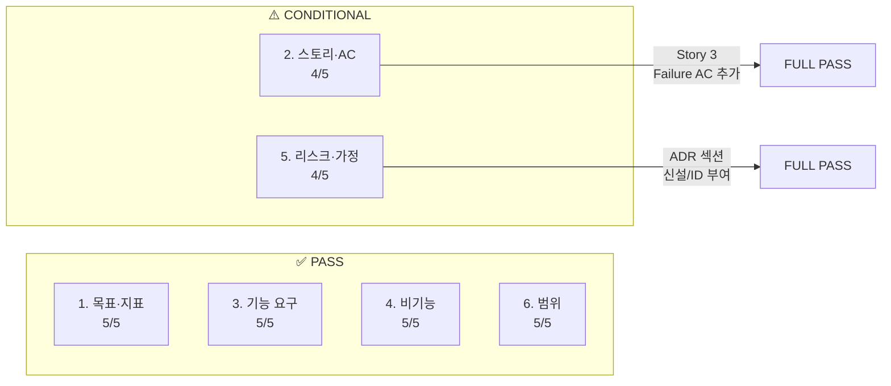

# PRD v0.2 최종 완성도 검토 리포트

- **검토 대상:** `03_PRD-Drafts/PRD-v0.2.md`
- **검토 기준:** 사용자 제공 6개 항목 패스 조건 체크리스트
- **검토일:** 2026-04-15

---

## 종합 판정

| # | 항목 | 판정 | 점수 |
|:---:|---|:---:|:---:|
| 1 | 목표·지표 | ✅ **PASS** | 5/5 |
| 2 | 스토리·AC | ⚠️ **CONDITIONAL PASS** | 4/5 |
| 3 | 기능 요구 | ✅ **PASS** | 5/5 |
| 4 | 비기능 | ✅ **PASS** | 5/5 |
| 5 | 리스크·가정 | ⚠️ **CONDITIONAL PASS** | 4/5 |
| 6 | 범위 | ✅ **PASS** | 5/5 |
| | **종합** | **28 / 30** | |

> **전체 판정: CONDITIONAL PASS** — 2건의 보완 권고 사항 해소 시 FULL PASS

---

## 1. 목표·지표 — ✅ PASS (5/5)

### 패스 조건: 북극성·보조 KPI 수치화 / 기준선·목표·측정 창구 명시

| 세부 확인 | 충족 여부 | 근거 위치 |
|---|:---:|---|
| 북극성 KPI 수치화 | ✅ | §1-3: `(방어된 손실액 ÷ 도입 전 총 손실액) × 100` → 목표 ≥ 90% |
| 북극성 계산 공식 명시 | ✅ | L66: 계산식 + 구성요소별 정의 (L68-71) |
| 기준선 (As-Is) | ✅ | 0% (도구 부재) |
| 목표값 (To-Be) | ✅ | ≥ 90% |
| 측정 경로/창구 | ✅ | "파일럿 고객 제출 Before/After 손실 장부 대조" |
| 보조 KPI 5개 수치화 | ✅ | §1-3 L75-81: 결재율, 절감률, 연동 성공률, 고객 확보, NPS 각각 기준선·목표·주기·경로 명시 |
| 페르소나별 Outcome 매핑 | ✅ | §1-4 L89-97: 7개 Outcome × (기준선 + 목표값 + 주기 + 측정 경로) |

> **특이사항:** NPS 측정에 "표본 ≥ 20명, 응답률 ≥ 60% 충족 시 유효" 조건까지 명시 — 양호.

---

## 2. 스토리·AC — ⚠️ CONDITIONAL PASS (4/5)

### 패스 조건: Given-When-Then + SLO(명확한 수치) / 실패 케이스 2개 이상

| 세부 확인 | 충족 여부 | 근거 위치 |
|---|:---:|---|
| Story 1 GWT 구조 | ✅ | L182-190: 7개 AC 모두 Given-When-Then 컬럼 |
| Story 1 SLO 수치 | ✅ | 각 AC에 p95 시간, MAPE, 누락율, 복구율 등 명시 |
| Story 1 실패 케이스 | ✅ | AC-6 (API 폴백), AC-7 (PDF 타임아웃) — **2개** |
| Story 2 GWT 구조 | ✅ | L209-217: 7개 AC 모두 Given-When-Then 컬럼 |
| Story 2 SLO 수치 | ✅ | 오차율, 발송률, recall, 성공률 등 명시 |
| Story 2 실패 케이스 | ✅ | AC-6 (API 연동 끊김), AC-7 (알림톡 폴백) — **2개** |
| **Story 3 GWT 구조** | ✅ | L236-241: 4개 AC에 Given-When-Then |
| **Story 3 실패 케이스** | ⚠️ **FAIL** | **실패 AC 0개** — Post-MVP지만 패스 조건 미달 |

### 보완 권고 #1

> [!WARNING]
> **Story 3 (권혁수 콜드체인)에 실패 케이스 AC가 없습니다.**
>
> Post-MVP Story이지만, 체크리스트 기준상 "Story당 실패 케이스 2개 이상"을 충족하려면 최소 2개의 Failure AC가 필요합니다.
>
> **권고 추가 AC:**
> - **AC-5 (Failure):** GPS 신호 끊김 시 → 마지막 유효 위치 + 캐시 온도로 보수적 노선 재설정, 기사에게 "GPS 불안정" 경고
> - **AC-6 (Failure):** IoT 온도 센서 데이터 수신 지연(>1분) 시 → 관리자에게 즉시 알림 + 직전 정상 온도 데이터 기반 예측 유지

---

## 3. 기능 요구 — ✅ PASS (5/5)

### 패스 조건: MoSCoW·근거·의존성 / Could 이상 1스프린트 내 구현 가능성

| 세부 확인 | 충족 여부 | 근거 위치 |
|---|:---:|---|
| MoSCoW 분류 (Must/Should/Could/Won't) | ✅ | §4-1 L252-260: 7개 기능 전부 분류 |
| 근거 (AOS/DOS + 사분면) | ✅ | 각 기능에 AOS/DOS 점수, Q1~Q4 사분면 판정 명시 |
| 의존성 명시 | ✅ | §7-4 L586: "F3은 F2 선행 완료 필수" |
| Could 구현 가능성 | ✅ | F6 (모바일 UX)은 난이도 **2** — 1스프린트 내 충분 |
| Build/Buy/Partner 판정 | ✅ | §4-2 L270-281: 11개 기술 요소별 판정 + VPS 근거 |
| Should→Must 승격 불가 사유 | ✅ | L262: F4가 Should인 이유 (난이도 5, HW 의존성) 명시 |

---

## 4. 비기능 — ✅ PASS (5/5)

### 패스 조건: 성능/보안/가용성/비용 임계치 + 모니터링 항목 명시

| 세부 확인 | 충족 여부 | 근거 위치 |
|---|:---:|---|
| **성능** 임계치 | ✅ | §5-1: 5개 항목 전부 p95 기준 (10분/5분/2초/30초/10초) + 측정 방법 |
| **가용성** SLA | ✅ | §5-2 L356: ≥ 99.5% (월 다운타임 ≤ 3.6시간), 측정 = CloudWatch + StatusPage |
| **보안** 요구사항 | ✅ | §5-3: TLS 1.3, AES-256, RBAC, 멀티테넌트 격리 + **검증 방법** 컬럼 |
| **비용** 제한 | ✅ | §5-3 L368: ≤ 500만 원/월, AWS Cost Explorer 검토 |
| **모니터링** | ✅ | §5-4: 4개 모니터링 항목 (인프라, ETL, 모델 드리프트, 비즈니스 KPI) + 도구 + 알림 기준 + 비고 |
| 폴백/재시도 정책 | ✅ | §5-2 L358-359: 캐시 폴백 ≤ 5초, 재시도 3회 (간격: 1/5/15분) |

---

## 5. 리스크·가정 — ⚠️ CONDITIONAL PASS (4/5)

### 패스 조건: ADR 수준의 설계 이유 기록 / 비즈니스 가설 검증 적절성 / 주요 리스크 3개 이상 + 대응책

| 세부 확인 | 충족 여부 | 근거 위치 |
|---|:---:|---|
| 리스크 **7**개 (≥ 3 조건 충족) | ✅ | §7-3 L568-576: R1~R7, 영향도·발생회률·완화 전략·VPS 출처 전부 명시 |
| 리스크 대응책 | ✅ | 각 리스크에 구체적 완화 전략 포함 |
| 가정 4개 | ✅ | §7-4 L582-585: API 스펙 유지, 무료 API, 고객 확보, 크레딧 |
| 의존성 3개 | ✅ | §7-4 L586-588 |
| 가설 검증 실험 설계 | ✅ | §8-2: 5개 실험, 통계 기준 (p < 0.05), 샘플 산출 근거 포함 |
| **ADR (설계 이유 기록)** | ⚠️ **부분 충족** | Build/Buy/Partner 판정표(§4-2)가 ADR *역할*을 하지만, **ADR 형식(제목/상태/컨텍스트/결정/결과)으로 독립 기술되지 않음** |

### 보완 권고 #2

> [!IMPORTANT]
> **ADR(Architecture Decision Record) 섹션이 독립적으로 존재하지 않습니다.**
>
> 현재 §4-2의 Build/Buy/Partner 판정표와 §6-3의 기술 스택 선정 근거가 ADR의 *내용*을 담고 있으나, 정식 ADR 형태(제목-상태-컨텍스트-결정-결과)로 작성되어 있지 않습니다.
>
> **보완 방법 (택 1):**
> 1. §7 또는 부록에 **ADR 섹션** 신설 — 주요 결정 3~5건을 ADR 형식으로 정리
> 2. 또는 §4-2와 §6-3를 **"이 결정은 ADR로 관리한다"** 문구와 함께 ADR ID를 부여
>
> **예시 ADR 후보:**
> - ADR-001: 예측 모델 자체 개발 (Build) vs 외부 MLaaS 도입 (Buy)
> - ADR-002: 멀티테넌트 논리 격리 vs 물리 격리
> - ADR-003: Puppeteer PDF 렌더링 vs 서버사이드 LaTeX

---

## 6. 범위 — ✅ PASS (5/5)

### 패스 조건: In/Out 명확 / PM 의사결정 충돌 없음

| 세부 확인 | 충족 여부 | 근거 위치 |
|---|:---:|---|
| In 항목 명시 (3개) | ✅ | §7-1 L545-547: F1, F2, F3 |
| Out 항목 명시 (3개) | ✅ | §7-1 L548-550: F4, F5, F6 |
| Out 복귀 조건 | ✅ | §7-2 L556-560: 각 Out 항목에 구체적 복귀 조건 + VPS 참조 |
| PM 충돌 여지 | ✅ | F4가 Must가 아닌 이유를 L262에서 명시적으로 해설 → 충돌 소지 제거 |
| Story↔기능 매핑 일관성 | ✅ | Story 1→F1, Story 2→F2+F3, Story 3→F4 (Out) — 모순 없음 |
| 실험↔AC 트레이서빌리티 | ✅ | §8-2 + §9-2에 `검증 대상 AC` 컬럼으로 추적 가능 |

---

## 보완 필요 사항 요약

| # | 항목 | 현재 상태 | 보완 내용 | 심각도 |
|:---:|---|---|---|:---:|
| **1** | Story 3 실패 AC | 0개 | Failure AC 2개 추가 (GPS 끊김, IoT 센서 지연) | 🟡 Medium |
| **2** | ADR 독립 섹션 | 내용은 있으나 비형식 | ADR 형식으로 3건 정리 또는 기존 판정표에 ADR ID 부여 | 🟡 Medium |

> **위 2건 보완 시 6개 항목 모두 FULL PASS (30/30) 달성**

---

## 추가 확인: 각 패스 조건 매핑 요약

