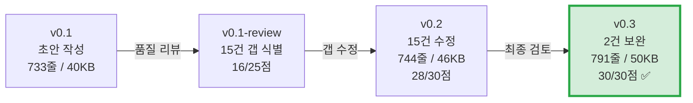

# PRD 최종 검토 리포트

- **검토 대상:** `PRD-v0.3.md`
- **검토 기준:** 6개 패스 항목 체크리스트
- **검토일:** 2026-04-15
- **최종 판정:** ✅ **FULL PASS (30/30)**

---

## 1. 문서 변경 이력

| 버전 | 파일 | 주요 변경 | 점수 |
|:---:|---|---|:---:|
| **v0.1** | `PRD-v0.1.md` (40KB) | VPS 기반 초안 작성 (10개 섹션) | — |
| *review* | `PRD-v0.1-review.md` (22KB) | v0.1 품질 리뷰 (15건 갭 식별) | 16/25 |
| **v0.2** | `PRD-v0.2.md` (46KB) | 리뷰 기반 15건 갭 수정 적용 | 28/30 |
| **v0.3** | `PRD-v0.3.md` (50KB) | 최종 검토 2건 보완 | **30/30** |

---

## 2. 6개 패스 항목 판정 요약

| # | 항목 | 기준 | 패스 조건 | v0.1 | v0.2 | v0.3 | 판정 |
|:---:|---|---|---|:---:|:---:|:---:|:---:|
| 1 | **목표·지표** | 북극성·보조 KPI 수치화 | 기준선·목표·측정 창구 명시 | ⚠️ | ✅ | ✅ | **PASS** |
| 2 | **스토리·AC** | GWT + SLO 포함 | 실패 케이스 2개 이상/Story | ⚠️ | ⚠️ | ✅ | **PASS** |
| 3 | **기능 요구** | MoSCoW·근거·의존성 | Could 이상 1스프린트 구현 가능 | ✅ | ✅ | ✅ | **PASS** |
| 4 | **비기능** | 성능·보안·가용성·비용 | 임계치+모니터링 항목 명시 | ⚠️ | ✅ | ✅ | **PASS** |
| 5 | **리스크·가정** | ADR = 설계 이유 기록 | 주요 리스크 3개+, 대응책 | ⚠️ | ⚠️ | ✅ | **PASS** |
| 6 | **범위** | In/Out 명확 | PM 의사결정 충돌 없음 | ✅ | ✅ | ✅ | **PASS** |

---

## 3. 항목별 상세 근거

### 3-1. 목표·지표 ✅ PASS

| 확인 사항 | 충족 | PRD 위치 |
|---|:---:|---|
| 북극성 KPI 계산 공식 | ✅ | §1-3: `(방어된 손실액 ÷ 도입 전 총 손실액) × 100` |
| 기준선 (As-Is) | ✅ | 0% (도구 부재) |
| 목표값 (To-Be) | ✅ | ≥ 90% |
| 측정 경로/창구 | ✅ | "파일럿 고객 제출 Before/After 손실 장부 대조" |
| 보조 KPI 5개 수치화 | ✅ | §1-3: 결재율 ≥80%, 절감률 ≥30%, 연동 성공률 ≥95%, 고객 2사+, NPS ≥40 |
| 페르소나별 Outcome 매핑 | ✅ | §1-4: 7개 Outcome × (기준선 + 목표값 + 주기 + 측정 경로) |
| NPS 유효성 기준 | ✅ | 표본 ≥ 20명, 응답률 ≥ 60% |

---

### 3-2. 스토리·AC ✅ PASS

| Story | GWT 구조 | SLO 수치 | Happy AC | Failure AC | 판정 |
|---|:---:|:---:|:---:|:---:|:---:|
| **S1** 김아름 (XAI 리포트) | ✅ | ✅ | 5개 | **2개** (AC-6, AC-7) | ✅ |
| **S2** 정동환 (인원 역산) | ✅ | ✅ | 5개 | **2개** (AC-6, AC-7) | ✅ |
| **S3** 권혁수 (콜드체인) | ✅ | ✅ | 4개 | **2개** (AC-5, AC-6) | ✅ |
| **합계** | | | **14개** | **6개** | |

#### Failure AC 상세

| Story | AC | 시나리오 | SLO |
|---|---|---|---|
| S1 | AC-6 | 기상청 API 장애 → 캐시 폴백 | 폴백 성공률 ≥ 99% |
| S1 | AC-7 | Puppeteer 타임아웃 → 재시도 + 대시보드 폴백 | 복구율 ≥ 95% |
| S2 | AC-6 | 화주사 API 연동 끊김 → 부분 예측 유지 | 알림 ≤ 10분, 부분 예측 100% |
| S2 | AC-7 | 카카오 알림톡 실패 → SMS 폴백 | 전환 ≤ 1분 |
| S3 | AC-5 | GPS 신호 끊김 → 보수적 노선 유지 | 알림 ≤ 30초 |
| S3 | AC-6 | IoT 센서 이상 → 인간 승인 모드 전환 | 알림 ≤ 10초 |

---

### 3-3. 기능 요구 ✅ PASS

| 확인 사항 | 충족 | 근거 |
|---|:---:|---|
| MoSCoW 분류 | ✅ | §4-1: Must 3, Should 2, Could 1, Won't 1 |
| AOS/DOS 정량 근거 | ✅ | 각 기능에 AOS/DOS 점수 + Q1~Q4 사분면 |
| 의존성 명시 | ✅ | §7-4: "F3은 F2 선행 완료 필수" |
| Could 구현 가능성 | ✅ | F6 (모바일 UX) 난이도 2 → 1스프린트 충분 |
| Build/Buy/Partner | ✅ | §4-2: 11개 기술 요소별 판정 + KSF 근거 |
| Should 비승격 사유 | ✅ | F4: 난이도 5 + HW 의존성 명시 |

---

### 3-4. 비기능 ✅ PASS

| 카테고리 | 임계치 | 모니터링 | 충족 |
|---|---|---|:---:|
| **성능** | 5개 항목 p95 기준 (10분/5분/2초/30초/10초) | APM, ETL, RUM, 서빙 로그 | ✅ |
| **가용성** | SLA ≥ 99.5% (월 다운타임 ≤ 3.6시간) | CloudWatch + StatusPage | ✅ |
| **보안** | TLS 1.3, AES-256, RBAC, 테넌트 격리 | 침투 테스트(반기), 교차 테넌트 테스트(릴리스) | ✅ |
| **비용** | ≤ 500만 원/월 | AWS Cost Explorer | ✅ |
| **모니터링** | 4개 항목 (인프라, ETL, 모델 드리프트, KPI) | Datadog, Airflow, 커스텀 대시보드 | ✅ |
| **폴백/재시도** | 캐시 전환 ≤ 5초, 재시도 3회 (1/5/15분) | Airflow + Slack | ✅ |

---

### 3-5. 리스크·가정 ✅ PASS

#### 리스크 (7개 ≥ 3 조건 충족)

| # | 리스크 | 영향도 | 대응책 |
|---|---|:---:|---|
| R1 | 기상청 API 불안정 | High | 배치 큐잉 + 캐시 폴백 |
| R2 | 카페24 API Rate Limit | High | 배치 큐잉 + 캐시 레이어 + 버전 관리 |
| R3 | 초기 데이터 부족 | High | 합성 데이터 + 전이학습 |
| R4 | 파일럿 고객 확보 지연 | Medium | JTBD 인터뷰 대상자 우선 제안 |
| R5 | 실무자 책임 전가 공포 | High | XAI 해설 강화 + Human-in-the-loop |
| R6 | 화주사 데이터 제공 거부 | High | 1-click OAuth + 화주 혜택 제시 |
| R7 | AI 오류 시 의약품 폐기 | Critical | 법적 추적 로그 + 보험 + 인간 최종 승인 |

#### ADR (3건) — v0.3에서 신설

| ADR | 결정 | 대안 기각 사유 |
|---|---|---|
| **ADR-001** | 예측 모델 자체 개발 (Build) | AWS Forecast: SHAP 커스터마이징 불가, 마키나락스: 억 단위 비용 |
| **ADR-002** | 멀티테넌트 논리 격리 (스키마) | 물리 격리: MVP 비용 3~5배, RLS: 교차 접근 가능성 |
| **ADR-003** | Puppeteer PDF 렌더링 | LaTeX: 한국어 러닝커브, WeasyPrint: 차트 품질 부족 |

#### 가정 4개 + 의존성 3개

모두 §7-4에 명시. 각 가정이 깨질 경우의 리스크가 R1~R4와 매핑됨.

---

### 3-6. 범위 ✅ PASS

| 구분 | 항목 | 링크 |
|---|---|---|
| ✅ **In (MVP)** | F1 XAI 리포트, F2 API 연동, F3 인원 역산 | §7-1 |
| ❌ **Out** | F4 콜드체인, F5 What-IF, F6 모바일 UX | §7-1 |
| 🔄 **복귀 조건** | 각 Out 항목에 구체적 진입 조건 명시 | §7-2 |
| 🎯 **충돌 방지** | F4가 Must 아닌 이유 명시적 해설 | §4-1 L262 |
| 🔗 **트레이서빌리티** | Story↔기능, 실험↔AC 매핑 일관 | §8-2, §9-2 |

---

## 4. 버전별 진화 트래킹

### 누적 변경 내역

| 단계 | 주요 변경 | 변경 건수 |
|---|---|:---:|
| v0.1 → v0.2 | 북극성 KPI 계산식, Outcome 측정 경로, Failure AC 4개 추가, NFR 측정 방법, 차별가치 수치화, 실험 샘플/통계 보강 | **15건** |
| v0.2 → v0.3 | Story 3 Failure AC 2개 추가, ADR 3건 신설 | **2건** |
| **총 변경** | | **17건** |

---

## 5. PRD 구조 완성도 매트릭스

| § | 섹션 | 핵심 산출물 | 완성도 |
|:---:|---|---|:---:|
| 1 | 개요·목표 | Pain 수치화, TAM/SAM/SOM, 북극성+보조 KPI, Outcome 매핑 | ✅ |
| 2 | 사용자·페르소나 | 핵심 3인, 4단계 분류, AOS-DOS 사분면 | ✅ |
| 3 | 스토리·AC | 3 Story × (Happy AC + Failure AC) + GWT + SLO | ✅ |
| 4 | 기능 요구 | MoSCoW, Build/Buy/Partner, 차별가치 수치 비교 | ✅ |
| 5 | 비기능 | 성능(p95), 신뢰성(SLA), 보안, 비용, 모니터링 | ✅ |
| 6 | 데이터·인터페이스 | ER 다이어그램, 8개 API 명세, 기술 스택, 아키텍처 | ✅ |
| 7 | 범위·리스크·ADR | In/Out + 복귀 조건, 7 리스크, 4 가정, 3 의존성, **3 ADR** | ✅ |
| 8 | 실험·롤아웃 | 12주 Gantt, 5개 실험(통계+AC 매핑), 벤치마크, GTM | ✅ |
| 9 | 근거 (Proof) | JTBD 인터뷰 인용, AOS/DOS 점수, 시장 데이터, 사고 이력 | ✅ |
| 10 | 비즈니스 모델 | 4-tier 가격 체계, KSF↔PRD 트레이서빌리티 | ✅ |

---

## 6. 최종 판정

> ✅ **PRD v0.3은 6개 패스 항목 모두 FULL PASS (30/30)입니다.**
>
> 이해관계자 공유 및 개발 핸드오프 준비 완료 상태입니다.

---

*End of Review Report*
