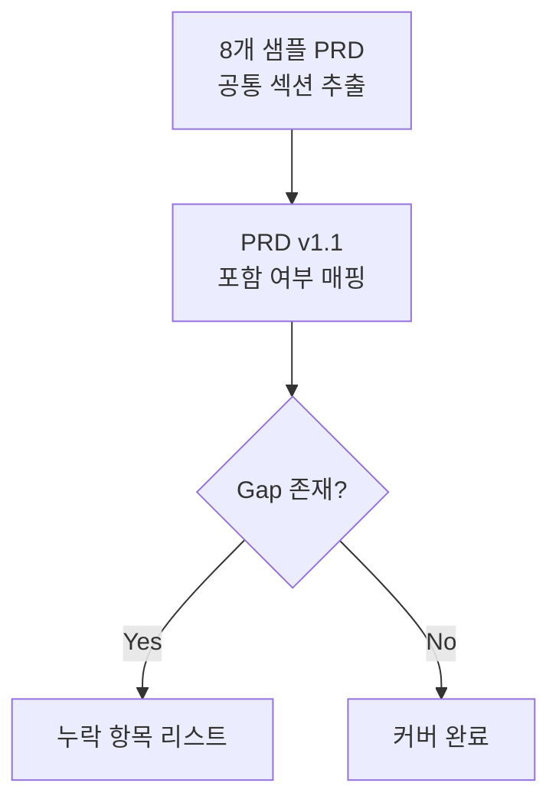

# PRD v1.1 종합 리뷰 리포트

> **대상 문서:** [PRD-v1.1.md](file:///e:/workspace/PRD-From-VPS-Sample/03_PRD-Drafts/PRD-v1.1.md)
> **기준 문서:** [PRD-v1.0.md](file:///e:/workspace/PRD-From-VPS-Sample/03_PRD-Drafts/PRD-v1.0.md) + [PRD_Review_Action_Plan.md](file:///e:/workspace/PRD-From-VPS-Sample/temp/PRD_Review_Action_Plan.md)
> **비교 샘플:** 8개 샘플 PRD 문서
> **리뷰 일시:** 2026-04-18

---

## Part 1: Action Plan 이행 점검

[PRD_Review_Action_Plan.md](file:///e:/workspace/PRD-From-VPS-Sample/temp/PRD_Review_Action_Plan.md)에서 제시한 9개 항목의 이행 상태를 점검합니다.

### §2. 문서별 상세 피드백 이행 현황

| # | Action Plan 항목 | 지시 | 이행 여부 | 비고 |
|---|---|---|:---:|---|
| 1 | **2-3. AOS-DOS 사분면 요약** | 삭제. 내용은 서문에 녹여 서술 | ✅ 완료 | v1.0의 §2-3이 v1.1에서 완전 삭제됨. 콜드체인 배제 언급이 §2-1 note에 간접 녹아 있음 |
| 2 | **AC Failure Path 예외 처리** | 유지 | ✅ 유지됨 | AC 1.3, 1.4, 2.3, 2.4에 Exception AC가 그대로 보존 |
| 3 | **MoSCoW 우선순위 보완** | Should/Could 항목 재추출 | ✅ 완료 | v1.0에는 Must/Won't만 존재 → v1.1에 **Should(F5)**, **Could(F6)** 추가됨 |
| 4 | **4-3. 차별 및 포지셔닝 전략** | '4사분면' 문맥 제거, Niche 중심 수정 | ✅ 완료 | v1.0의 "4사분면(특화&챌린저)" 표현 → v1.1에서 "Niche 리더" 중심 텍스트로 전면 수정 |
| 5 | **10. 비즈니스 모델 챕터** | 삭제 (GTM/사업계획서로 이관) | ✅ 완료 | v1.0의 §10 전체 삭제됨. 가격 티어 내용 PRD에서 완전 제거 |

### §3. 구조적 추가 권장 항목 이행 현황

| # | 추가 권장 항목 | 이행 여부 | v1.1 위치 |
|---|---|:---:|---|
| 1 | **제품 원칙 및 의사결정 게이트** | ✅ 완료 | §1-2 (3개 원칙 기술) |
| 2 | **경쟁 대안 대비 수치 목표** | ✅ 완료 | §4-2 (4개 대안 벤치마크 테이블) |
| 3 | **In Scope / Out of Scope** | ✅ 완료 | §7-1 (In/Out 명시) |
| 4 | **롤아웃(배포) 계획** | ✅ 완료 | §8-1 (Phase 1~3, Sprint 단위) |

> [!TIP]
> **Action Plan 이행 결론:** 9개 항목 모두 **100% 이행 완료**. v1.0의 구조적 문제가 v1.1에서 올바르게 반영되었습니다.

---

## Part 2: 8개 샘플 PRD 대비 목차 Gap 분석

### 분석 대상 샘플 PRD 목차 종합

8개 샘플 PRD에서 공통적으로 등장하는 섹션을 추출하여, PRD v1.1과의 포함 여부를 매핑합니다.

### 섹션별 포함 매핑 (v1.1 vs 샘플 8건)

| 섹션 | v1.1 | 샘플1 | 한끗 | CHY | JKI | KMH | LSR | PHJ | SHD | 출현 빈도 |
|---|:---:|:---:|:---:|:---:|:---:|:---:|:---:|:---:|:---:|:---:|
| **1. 문제 정의 (Pain 지표)** | ✅ | ✅ | ✅ | ✅ | ✅ | ✅ | ✅ | ✅ | ✅ | 8/8 |
| **1. 목표 (Desired Outcome 수치화)** | ✅ | ✅ | ✅ | ✅ | ✅ | ✅ | ✅ | ✅ | ✅ | 8/8 |
| **1. 성공 지표 (North Star + 보조 KPI)** | ✅ | ✅ | ✅ | ✅ | ✅ | ✅ | ✅ | ✅ | ✅ | 8/8 |
| **1. 제품 원칙 / 의사결정 게이트** | ✅ | — | — | ✅ | — | — | — | — | — | 2/8 |
| **1. 시장 규모 (TAM/SAM/SOM)** | ✅ | ✅ | ✅ | — | — | — | ✅ | — | — | 3/8 |
| **2. 사용자/페르소나** | ✅ | ✅ | ✅ | ✅ | ✅ | ✅ | ✅ | ✅ | ✅ | 8/8 |
| **2. 사용자 여정 (CJM)** | ✅ | ✅ | ✅ | ✅ | — | ✅ | ✅ | ✅ | — | 6/8 |
| **3. 사용자 스토리 + AC** | ✅ | ✅ | ✅ | ✅ | ✅ | ✅ | ✅ | ✅ | ✅ | 8/8 |
| **4. 기능 요구사항 (MoSCoW)** | ✅ | ✅ | ✅ | ✅ | ✅ | ✅ | ✅ | ✅ | ✅ | 8/8 |
| **4. 경쟁 대안 대비 벤치마크 수치** | ✅ | ✅ | ✅ | ✅ | — | ✅ | ✅ | ✅ | — | 6/8 |
| **4. Build/Buy/Partner 판정** | ✅ | — | — | — | — | — | — | — | — | 0/8 |
| **5. 비기능 요구사항 (NFR)** | ✅ | ✅ | ✅ | ✅ | ✅ | ✅ | ✅ | ✅ | ✅ | 8/8 |
| **5. 모니터링 항목** | — | ✅ | ✅ | ✅ | ✅ | ✅ | — | ✅ | ✅ | 7/8 |
| **6. 데이터/ERD** | ✅ | ✅ | ✅ | ✅ | ✅ | ✅ | ✅ | ✅ | ✅ | 8/8 |
| **6. 외부/내부 API** | ✅ | ✅ | ✅ | ✅ | ✅ | ✅ | ✅ | ✅ | ✅ | 8/8 |
| **7. In Scope / Out of Scope** | ✅ | ✅ | ✅ | ✅ | ✅ | ✅ | ✅ | ✅ | ✅ | 8/8 |
| **7. 리스크 + 완화 전략** | ✅ | ✅ | ✅ | ✅ | ✅ | ✅ | ✅ | ✅ | ✅ | 8/8 |
| **7. 가정 (Assumptions)** | — | ✅ | ✅ | ✅ | ✅ | ✅ | ✅ | ✅ | ✅ | 8/8 |
| **7. 의존성 (Dependencies)** | — | ✅ | ✅ | — | ✅ | ✅ | ✅ | — | ✅ | 6/8 |
| **7. ADR (설계 결정 기록)** | ✅ | — | ✅ | — | — | ✅ | — | — | — | 3/8 |
| **8. 롤아웃 계획 (Phase별)** | ✅ | ✅ | ✅ | ✅ | ✅ | ✅ | ✅ | ✅ | ✅ | 8/8 |
| **8. 베타 채널 설계** | — | ✅ | ✅ | ✅ | ✅ | ✅ | ✅ | ✅ | — | 6/8 |
| **8. 실험 가설/통계 설계** | ✅ | ✅ | ✅ | ✅ | ✅ | ✅ | ✅ | ✅ | ✅ | 8/8 |
| **8. 경쟁 벤치마크 계획** | — | ✅ | ✅ | ✅ | ✅ | ✅ | ✅ | ✅ | ✅ | 8/8 |
| **8. GTM 전략** | ✅ | — | — | — | ✅ | — | — | — | — | 1/8 |
| **9. 근거 (Proof)** | ✅ | ✅ | ✅ | ✅ | ✅ | ✅ | ✅ | ✅ | ✅ | 8/8 |
| **문서 이력/변경 로그** | — | — | ✅ | — | — | — | — | — | — | 1/8 |

---

## Part 3: 누락 항목 상세 분석 및 보강 권고

### 🔴 누락 (8/8 샘플에서 등장하나 v1.1에 없음)

#### 1. **가정 (Assumptions)** — 출현 빈도: 8/8

> [!IMPORTANT]
> v1.1의 §7에 **리스크와 ADR은 있으나, 가정(Assumptions) 섹션이 완전히 누락**되어 있습니다.

**현재 상태:** v1.1 §7 리스크에 간접적으로 "전이학습 적용"이나 "원클릭 인증" 등의 가정이 녹아 있으나, 명시적 가정 목록이 없습니다.

**보강 필요 내용 (예시):**
- 카페24/스마트스토어 API가 안정적으로 주문/재고 데이터를 제공할 것이라는 가정
- 화주사들이 OAuth 1-Click 인증에 동의하는 비율이 충분할 것이라는 가정
- 초기 신규 고객사도 최소 6개월 치 과거 데이터를 보유한다는 가정
- 카카오 알림톡 API 정책이 MVP 기간 동안 유지될 것이라는 가정

---

#### 2. **의존성 (Dependencies)** — 출현 빈도: 6/8

> [!IMPORTANT]
> 리스크의 완화 조치에 암시되어 있으나, 기술적/사업적 의존성을 명시한 별도 섹션이 없습니다.

**보강 필요 내용 (예시):**

| 의존성 | 유형 | 영향 범위 |
|---|---|---|
| 기상청 공공데이터 API | 외부 서비스 | F1 XAI 리포트 데이터 소스 |
| 카페24/스마트스토어 API | 외부 서비스 | F2 이커머스 연동 모듈 |
| 카카오 비즈 API | 외부 서비스 | F3 알림톡 전송 |
| Apache Airflow | 오픈소스 | ETL 파이프라인 |
| SHAP 라이브러리 | 오픈소스 | XAI 원인 분석 |

---

### 🟡 부분 누락 (6/8 이상 샘플에서 등장)

#### 3. **모니터링 항목 (Observability)** — 출현 빈도: 7/8

**현재 상태:** v1.1 §5 NFR에 성능/신뢰성/보안은 있으나, 운영 모니터링 대시보드, 로그 관리, 알림 기준이 **별도 항목으로 분리되어 있지 않음**.

**보강 권고:**

| 구분 | 모니터링 대상 | 도구 | 알림 기준 |
|---|---|---|---|
| 로그 | API 응답 시간, ETL 파이프 실패 | Datadog/CloudWatch | p95 > 목표치 시 Slack 알림 |
| 대시보드 | 발주 채택률, 리포트 생성 수 | Amplitude/Mixpanel | 주간 KPI 리뷰 |
| 알림 | 기상청 API 장애, 카카오 전송 실패 | PagerDuty | 즉시 알림 |

---

#### 4. **베타 채널 설계** — 출현 빈도: 6/8

**현재 상태:** v1.1 §8-1에 Phase별 배포 계획은 있으나, 베타 **대상 선정 기준, 규모, 구체적 목적**이 명시되지 않음. "2~3곳의 파일럿 사이트"라는 단 한 줄만 존재.

**보강 권고:**

| 단계 | 대상 | 규모 | 목적 |
|---|---|---|---|
| Alpha | 내부 팀 + 지인 | 5명 | 크리티컬 버그, 데이터 파이프라인 검증 |
| Closed Beta | 이커머스 MD 3사 | 3사 × 2명 | F1(XAI 리포트) 정확도·1-Pass 통과율 검증 |
| Closed Beta | 3PL 물류센터 2곳 | 2곳 × 1명 | F2·F3 연동·인력 역산 정합성 검증 |
| Open Beta | 구독 의향 고객 | 10사 | 전체 퍼널 전환율, KPI 실측 |

---

#### 5. **경쟁 벤치마크 실험 계획** — 출현 빈도: 8/8

**현재 상태:** v1.1 §4-2에 경쟁 대안 대비 **수치 목표**는 잘 정의되어 있으나, §8에는 이를 **어떻게 실측/비교할 것인지에 대한 벤치마크 실험 계획**이 없음. 현재 실험 설계(§8-2)는 자체 A/B 테스트만 다루며, 경쟁 대안과의 직접 비교 프로토콜이 빠져 있음.

**보강 권고:**

| 비교 대상 | 비교 방법 | 측정 항목 | 성공 기준 |
|---|---|---|---|
| 수기 엑셀 수집 | 동일 과업 시간 측정 (파일럿 MD 6명) | 발주량 산출 소요 시간 | 95% 단축 실측 |
| 대형 SCM 솔루션 | 도입 프로세스 비교 (시간·비용) | 연동 완료까지 리드타임 | 당일 즉시 연동 달성 |
| 구두 소통 (센터장) | 인건비 오차 전후 비교 (파일럿 2곳) | 오버 스케줄링 비용 | 오차율 ±5% 이내 |

---

### 🟢 선택적 보강 (3/8 이하 등장이나 품질 향상에 도움)

| 항목 | 출현 빈도 | 현재 v1.1 상태 | 권고 |
|---|---|---|---|
| **문서 변경 이력 (Changelog)** | 1/8 | ❌ 없음 | v1.0 → v1.1 변경 요약을 문서 말미에 추가하면 버전 관리에 유용 |
| **기능 흐름 다이어그램** | 2/8 | ❌ 없음 | F1→F2→F3 기능 간 연결 흐름을 시각화하면 개발자 이해도 향상 |
| **비용 제약 (인프라/API 비용)** | 3/8 | ❌ 없음 | 월 인프라 비용 상한, API 호출 비용 예상치 등 명시 권고 |

---

## Part 4: 최종 요약

### 전체 평가

| 평가 항목 | 상태 | 점수 |
|---|---|:---:|
| Action Plan 이행률 | 9/9 항목 완료 | ⭐⭐⭐⭐⭐ |
| 표준 PRD 구조 준수율 | 주요 항목 대부분 커버 | ⭐⭐⭐⭐ |
| 콘텐츠 품질 (서사·수치·다이어그램) | 페르소나 서사, KPI 수치화, Mermaid 다이어그램 우수 | ⭐⭐⭐⭐⭐ |

### 보강 우선순위

| 우선순위 | 누락 항목 | 사유 |
|:---:|---|---|
| 🔴 **P0** | **가정 (Assumptions)** | 8/8 샘플 전부 포함. 검증되지 않은 전제가 명시되지 않으면 리스크 관리 불완전 |
| 🔴 **P0** | **의존성 (Dependencies)** | 외부 API 의존도가 높은 제품 특성상 필수 |
| 🟡 **P1** | **모니터링 항목** | 7/8 등장. NFR에 운영 관측성 부재 |
| 🟡 **P1** | **베타 채널 상세 설계** | 파일럿 대상·규모·검증 목적 구체화 필요 |
| 🟡 **P1** | **경쟁 벤치마크 실험 계획** | §4-2 수치 목표는 있으나 실측 프로토콜 부재 |
| 🟢 **P2** | 문서 변경 이력 / 기능 흐름도 / 비용 제약 | 선택적 품질 향상 |

> [!NOTE]
> PRD v1.1은 Action Plan의 모든 항목을 충실히 이행했으며, 전체적인 문서 품질이 크게 향상되었습니다. 위 P0/P1 항목만 보강하면 샘플 PRD들과 동등하거나 그 이상의 구조적 완성도를 갖출 수 있습니다.
