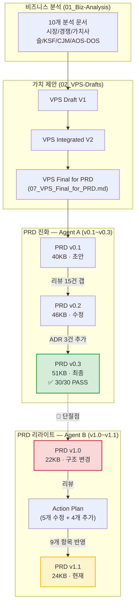

# PRD v1.1 맥락 분석 및 SRS 전환 판단 리포트

> **목적:** 누락 항목의 실제 보강 필요성 판단 + 이전 PRD 리뷰 프로세스의 적절성 평가 + SRS 단계 진행 가이합성 분석
> **분석 일시:** 2026-04-18

---

## Part 1: 문서 이력 전체 맥락 추적

### 문서 진화 계보



---

## Part 2: 핵심 발견 — PRD v0.3 → v1.0 전환 과정의 문제

### 🔴 가장 중요한 발견: **v0.3 → v1.0 전환 시 콘텐츠 대규모 손실 발생**

> [!CAUTION]
> PRD v0.3 (51KB, 791줄, 30/30 PASS)에서 PRD v1.0 (22KB, ~320줄)으로 전환하는 과정에서 **문서 용량이 57% 감소**하였습니다. Action Plan에서 명시한 삭제/수정 범위를 훨씬 초과하는 콘텐츠 손실이 발생했습니다.

### Action Plan이 지시한 것 vs 실제 발생한 것

| Action Plan 지시 | 의도된 영향 | **실제 발생** |
|---|---|---|
| §2-3 AOS-DOS 사분면 삭제 | 약 30줄 삭제 | ✅ 올바르게 삭제 |
| §10 비즈니스 모델 삭제 | 약 30줄 삭제 | ✅ 올바르게 삭제 |
| §4-3 차별 포지셔닝 수정 | 텍스트 수정 | ✅ 올바르게 수정 |
| MoSCoW Should/Could 추가 | 약 10줄 추가 | ✅ 올바르게 추가 |
| 4개 신규 섹션 추가 | 약 100줄 추가 | ✅ 올바르게 추가 |
| — | — | 🔴 **의도하지 않은 삭제 발생** |

### v0.3에 존재했으나 v1.1에서 사라진 콘텐츠

| v0.3 섹션 | 내용 | v1.1 상태 | 손실 심각도 |
|---|---|---|:---:|
| **§7-4. 가정 및 의존성** | 가정 4개 + 의존성 3개 (R1~R4와 명시적 매핑) | ❌ **완전 삭제** | 🔴 심각 |
| **§5-4. 모니터링 항목** | 4개 모니터링 항목 (인프라/ETL/모델 드리프트/KPI) + 도구 + 알림 기준 | ❌ **완전 삭제** | 🔴 심각 |
| **§8-3. 경쟁 벤치마크 계획** | 3개 벤치마크 항목 + 측정 방법 + 일정 | ❌ **완전 삭제** | 🟡 중요 |
| **§8-2. 실험 5개** 중 PoC-3, EXP-04 | 연동 편의성 실험, MAPE 벤치마크 실험 | ❌ **삭제** (2개→2개로 축소) | 🟡 중요 |
| **§4-2. Build/Buy/Partner 판정** 상세 | 11개 기술 요소별 판정 근거 테이블 | ⚠️ **ADR로 축약됨** | 🟢 경미 |
| **Story 3 (권혁수 콜드체인)** 전체 | AC 6개 포함 Post-MVP 스토리 | ✅ **의도적 삭제** (콜드체인 배제) | ✅ 적절 |
| **§6-2. API 8개 상세 스펙** | 입출력/제약 포함 테이블 | ⚠️ **3줄 요약으로 축약** | 🟡 중요 |

> [!IMPORTANT]
> **핵심 결론:** 이전 리뷰에서 8개 샘플 PRD와 비교하여 "누락"으로 식별한 항목들은 **사실 샘플 대비 누락이 아니라, v0.3에서 이미 완성되었던 콘텐츠가 v1.0 리라이트 과정에서 의도치 않게 손실된 것**입니다.

---

## Part 3: 이전 Agent의 PRD 리뷰 프로세스 평가

### Agent A (v0.1 → v0.3): PRD 품질 리뷰

| 평가 항목 | 판정 | 상세 |
|---|:---:|---|
| 체계적 리뷰 프레임워크 | ✅ 우수 | 6개 패스 항목 체크리스트, 점수제(30점) 운영 |
| 갭 식별 정확도 | ✅ 우수 | v0.1에서 15건 갭 → v0.2에서 모두 수정 |
| ADR 추가 판단 | ✅ 적절 | v0.3에서 3건 ADR 추가로 설계 결정 문서화 |
| 최종 품질 | ✅ 완성 | 30/30 FULL PASS, SRS 작성 가능 수준 |

### Agent B (v0.3 → v1.0 → v1.1): PRD 리라이트

| 평가 항목 | 판정 | 상세 |
|---|:---:|---|
| Action Plan 수립 | ✅ 적절 | 5개 수정/삭제 + 4개 추가 항목이 논리적으로 타당 |
| Action Plan 이행 | ✅ 완료 | 9개 항목 모두 v1.1에 반영됨 |
| **콘텐츠 보존** | 🔴 **실패** | Action Plan에서 지시하지 않은 콘텐츠(가정, 의존성, 모니터링, 벤치마크 계획 등)가 리라이트 과정에서 탈락 |
| 문서 볼륨 관리 | 🔴 **실패** | 51KB → 22KB → 24KB. 삭제 이유가 없는 섹션까지 사라짐 |

> [!WARNING]
> **Agent B의 핵심 문제:** Action Plan은 올바르게 이행했으나, "리라이트"를 "처음부터 새로 작성"으로 해석한 것으로 보입니다. 기존 v0.3의 콘텐츠를 기반으로 수정/보완해야 했으나, 사실상 새 문서를 작성하면서 Action Plan에 명시되지 않는 콘텐츠를 복원하지 못했습니다.

---

## Part 4: 누락 항목별 보강 필요성 판단

### 판단 기준
- **v0.3에 존재했는가?** → 존재했다면 복원이 맞음 (신규 작성이 아님)
- **SRS 작성에 필수적인가?** → SRS에서 해당 정보를 참조하는가?
- **보강하지 않으면 SRS에서 어떤 문제가 생기는가?**

### 항목별 판단

#### 1. 가정 (Assumptions) — 🔴 **반드시 보강**

| 기준 | 결과 |
|---|---|
| v0.3에 존재? | ✅ §7-4에 가정 4개 + 의존성 3개 존재 |
| SRS 참조? | ✅ SRS §2.4 "가정 및 제약사항"에 직접 매핑 |
| 미보강 시 문제 | SRS에서 시스템 제약사항과 전제조건을 정의할 수 없음. 리스크-가정 간 추적성(Traceability) 단절 |

**v0.3 원본에서 복원할 내용:**
```
가정 1: 카페24·스마트스토어 API가 현재 스펙대로 최소 12개월 유지
가정 2: 기상청 단기예보 API 무료 이용이 MVP 기간 동안 지속
가정 3: 파일럿 고객(2사)이 Sprint 3 시작 전까지 확보 가능
가정 4: AWS 스타트업 크레딧으로 초기 인프라 비용 자체 부담 없이 운영 가능
```

#### 2. 의존성 (Dependencies) — 🔴 **반드시 보강**

| 기준 | 결과 |
|---|---|
| v0.3에 존재? | ✅ §7-4에 3개 의존성 존재 |
| SRS 참조? | ✅ SRS에서 시스템 인터페이스 설계의 전제조건으로 활용 |
| 미보강 시 문제 | API 연동 모듈 설계 시 선후관계 파악 불가. F3→F2 의존성이 Sprint 계획에 영향 |

**v0.3 원본에서 복원할 내용:**
```
의존성 1: F3(인원 역산)은 F2(API 연동 모듈)의 선행 완료 필수
의존성 2: XAI 해설 품질은 LLM 서머라이저의 한국어 경영진 톤 조정 성능에 의존
의존성 3: PDF 리포트 양식은 파일럿 고객의 기존 결재 양식 수집 후 확정
```

#### 3. 모니터링 항목 — 🔴 **반드시 보강**

| 기준 | 결과 |
|---|---|
| v0.3에 존재? | ✅ §5-4에 4개 항목 완비 (인프라/ETL/모델 드리프트/KPI) |
| SRS 참조? | ✅ SRS NFR 섹션에서 운영 관측성(Observability) 요구사항으로 반드시 참조 |
| 미보강 시 문제 | SRS에서 모니터링 요구사항을 정의할 근거 문서 부재. NFR이 "무엇을 달성"만 있고 "어떻게 감시"가 없음 |

#### 4. 베타 채널 상세 설계 — 🟡 **권장 (선택적)**

| 기준 | 결과 |
|---|---|
| v0.3에 존재? | ⚠️ v0.3에도 "파일럿 2사 PoC"라는 한 줄 수준. 상세 채널 설계는 없었음 |
| SRS 참조? | ❌ SRS에서 직접 참조하지 않음. 배포 계획은 별도 문서(릴리즈 플랜)에서 다룸 |
| 미보강 시 문제 | SRS 작성에는 영향 없음. 다만 PRD 자체 품질 측면에서는 보강이 바람직 |

**판정:** SRS 전환 전 필수는 아님. v1.2 또는 별도 릴리즈 플랜에서 다뤄도 됨.

#### 5. 경쟁 벤치마크 실험 계획 — 🟡 **권장 (선택적)**

| 기준 | 결과 |
|---|---|
| v0.3에 존재? | ✅ §8-3에 3개 항목 존재 |
| SRS 참조? | ❌ SRS에서 직접 참조하지 않음. 실험 설계는 PRD 영역 |
| 미보강 시 문제 | SRS 작성에는 영향 없음. 다만 검증 계획 완성도에 영향 |

**판정:** SRS 전환 전 필수는 아님. 다만 v0.3에 있었으므로 복원 자체는 쉬움.

---

## Part 5: 최종 판단 및 권고

### SRS 전환 전 필수 보강 항목 (3건)

| # | 항목 | 보강 방법 | 예상 소요 |
|:---:|---|---|:---:|
| 1 | **가정 (Assumptions)** | v0.3 §7-4에서 복원 + 현재 맥락에 맞게 수정 | 5분 |
| 2 | **의존성 (Dependencies)** | v0.3 §7-4에서 복원 | 5분 |
| 3 | **모니터링 항목** | v0.3 §5-4에서 복원 + v1.1 NFR 체계에 맞게 재구성 | 10분 |

### SRS 전환 전 선택적 보강 항목 (2건)

| # | 항목 | 판단 | 대안 |
|:---:|---|---|---|
| 4 | 베타 채널 상세 설계 | SRS 전환에 불필요 | 별도 릴리즈 플랜 문서에서 다룸 |
| 5 | 경쟁 벤치마크 실험 계획 | SRS 전환에 불필요 | v0.3에서 복원하면 쉬움 (선택) |

### 전체 맥락 유지 상태

| 맥락 계층 | 연결 상태 | 상세 |
|---|:---:|---|
| 비즈니스 분석 → VPS | ✅ 유지 | AOS/DOS, 페르소나, CJM 등이 VPS에 잘 반영됨 |
| VPS → PRD v0.3 | ✅ 유지 | VPS §참조가 PRD 전반에 일관되게 인용됨 |
| PRD v0.3 → PRD v1.0 | ⚠️ **부분 단절** | 콜드체인 제거는 의도적이나, 기타 콘텐츠 손실은 비의도적 |
| PRD v1.0 → PRD v1.1 | ✅ 유지 | Action Plan 9개 항목 정확히 반영 |
| **PRD v1.1 → SRS** | ⚠️ **조건부** | 가정/의존성/모니터링 3건 복원 후 진행 가능 |

> [!IMPORTANT]
> ### 최종 권고
> 
> **필수 3건만 보강하면 SRS 단계로 진행 가능합니다.**
> 
> 이 3건은 "새로 작성"이 아니라 v0.3에서 "복원"하는 작업이므로, 20분 이내로 완료 가능합니다. 보강 후 PRD v1.1은 SRS 작성을 위한 충분한 기반 문서가 됩니다.
> 
> 선택적 2건(베타 채널, 벤치마크)은 SRS 작성 병행 중 또는 이후에 PRD v1.2로 반영해도 무방합니다.
